---
## Author
author:
  name: Гурылев Артем Андреевич
  email: 1132236135@pfur.ru
  affiliation:
    - name: Российский университет дружбы народов

## Title
title: "Лабораторная работа №1"
subtitle: "Методы кодирования и модуляция сигналов"
license: "CC BY"
---

# Цель работы

Целью данной лабораторной работы является изучение методов кодирования и модуляции сигналов с помощью высоко уровнего языка программирования Octave.

# Выполнение лабораторной работы

Рассмотрим программу с синусоидальным графиком.([рис. @fig-001])

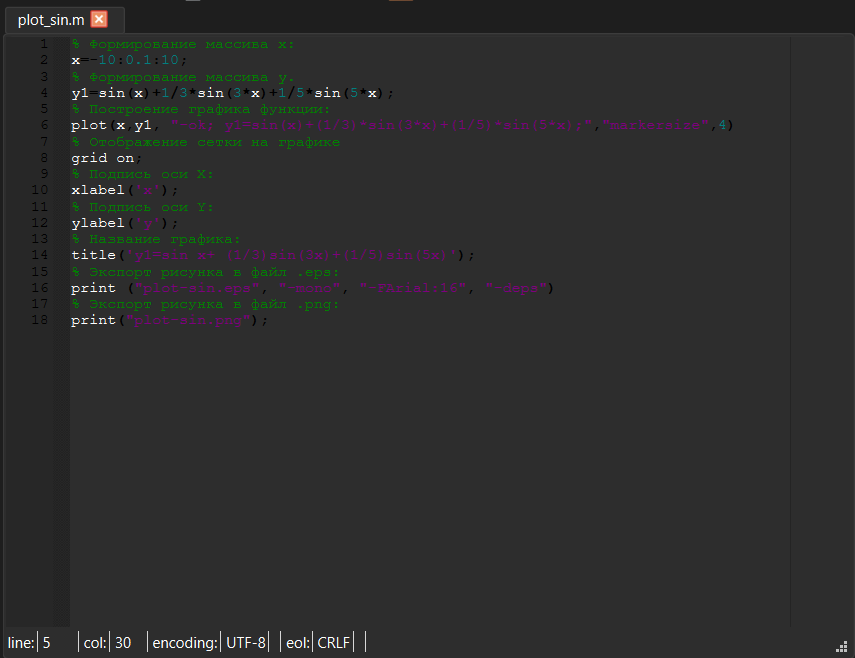{#fig-001}

Сам график, который выводит её код:([рис. @fig-002])

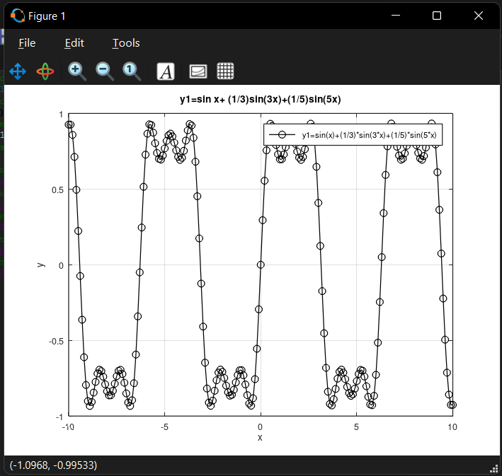{#fig-002}

Изменим код таким образом, чтобы добавить график косинуса.([рис. @fig-003])

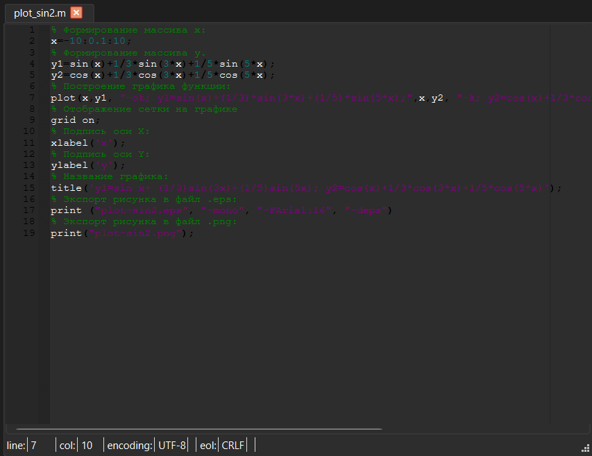{#fig-003}

Получившийся результат:([рис. @fig-004])

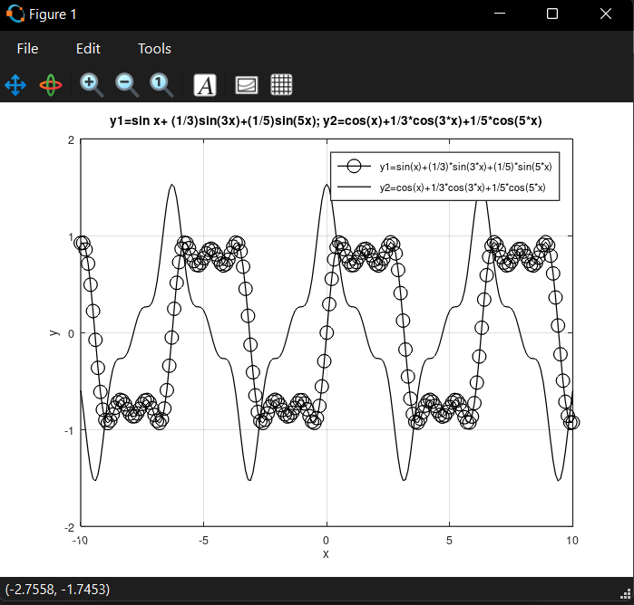{#fig-004}

Перейдём к графикам меандра. Изменив код, реализуем их через синусы.([рис. @fig-005])

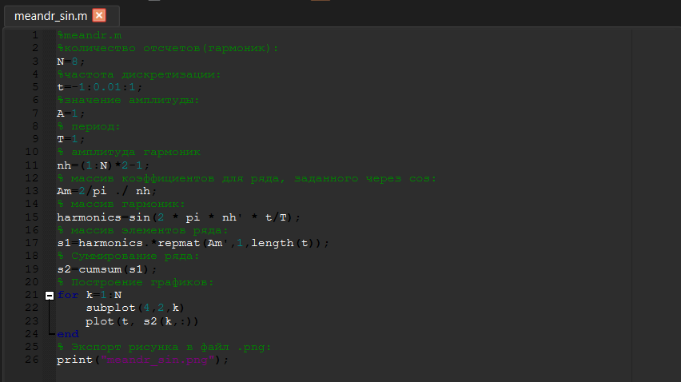{#fig-005}

Затем перейдём к преобразованию в спектры. Для начала построим два графика синусов разной частоты.([рис. @fig-006])

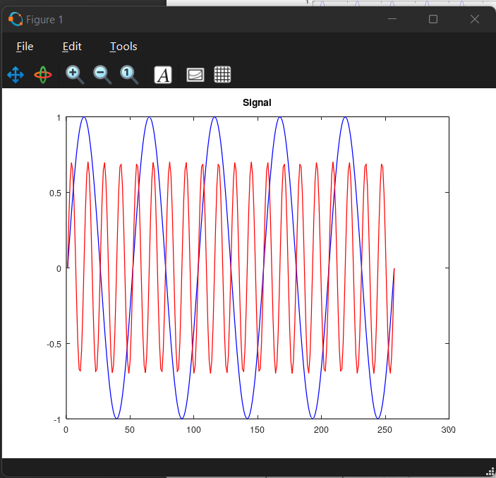{#fig-006}

Добавив код, преобразуем эти графики в спектры Фурье.([рис. @fig-007])

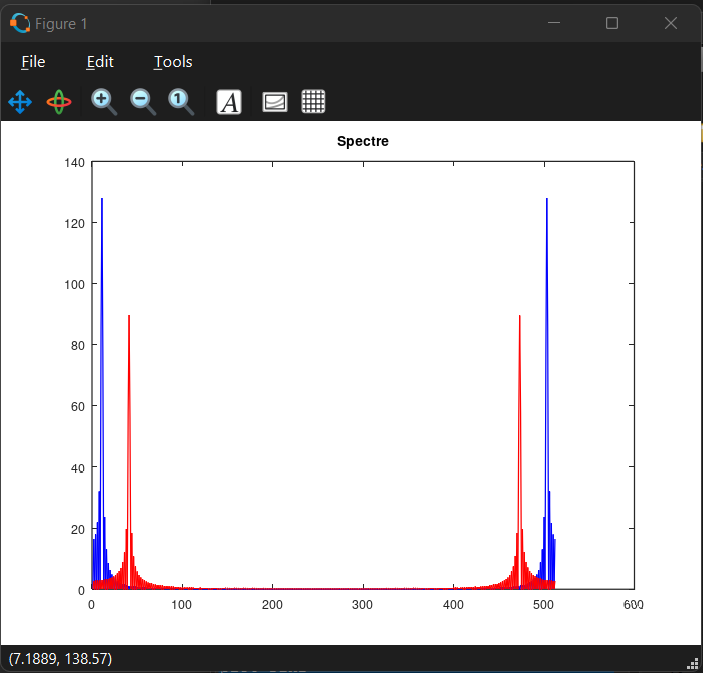{#fig-007}

Немного исправим график спектров.([рис. @fig-008])

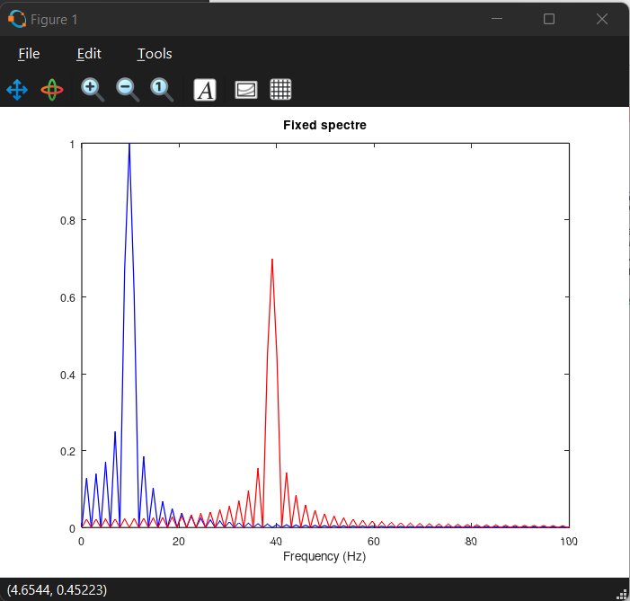{#fig-008}

Найдем спектр суммы всех сигналов.([рис. @fig-009])

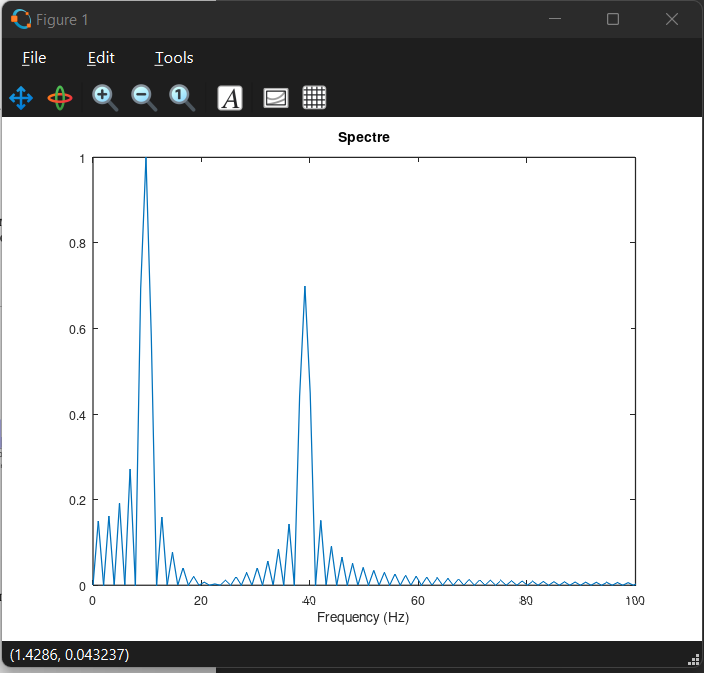{#fig-009}

Программа, суммирующая сигналы:([рис. @fig-010])

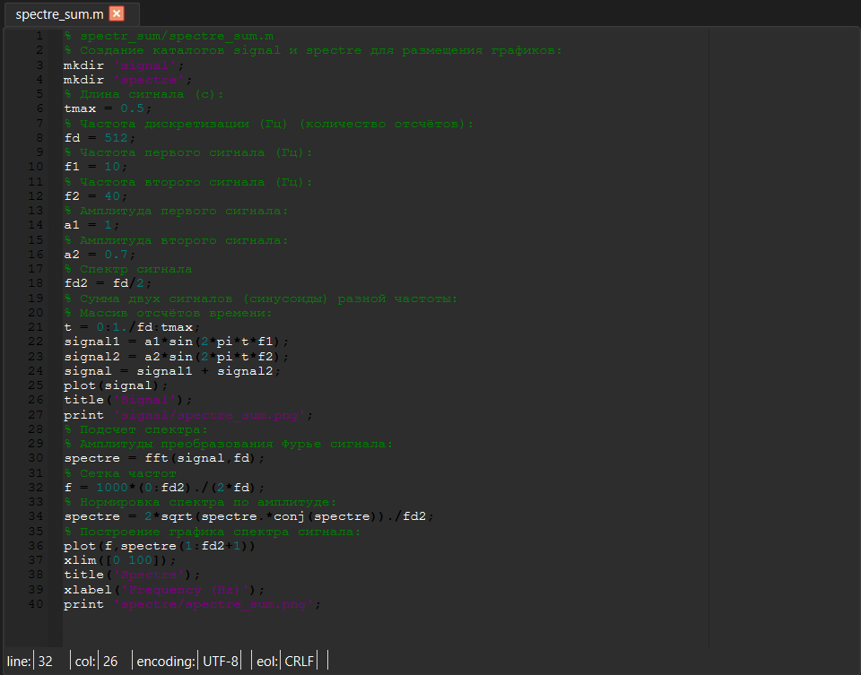{#fig-010}

Преобразуем амплитудно модулированный сигнал в спектры.([рис. @fig-011])

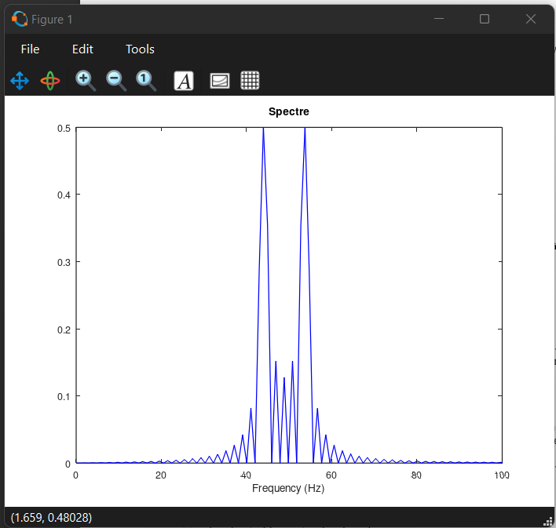{#fig-011}

Программа амплитудной модуляции:([рис. @fig-012])

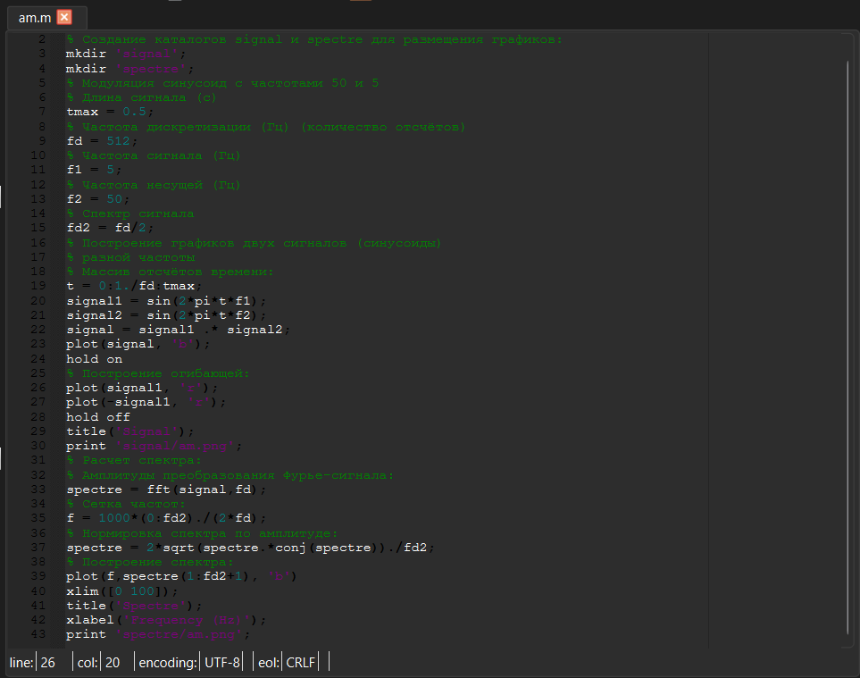{#fig-012}

Перейдём к кодировкам сигнала. После создания различных функций, запустим основную программу и посмотрим результат. В первом каталоге - графики всех кодировок сигналов.([рис. @fig-013])

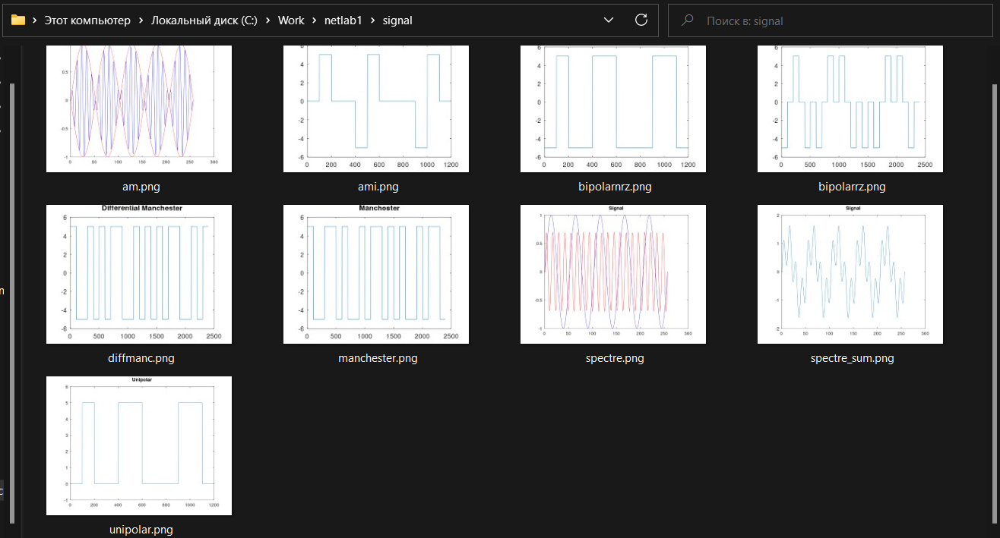{#fig-013}

Во втором каталоге - графики кодировок без самосинхронизации.([рис. @fig-014])

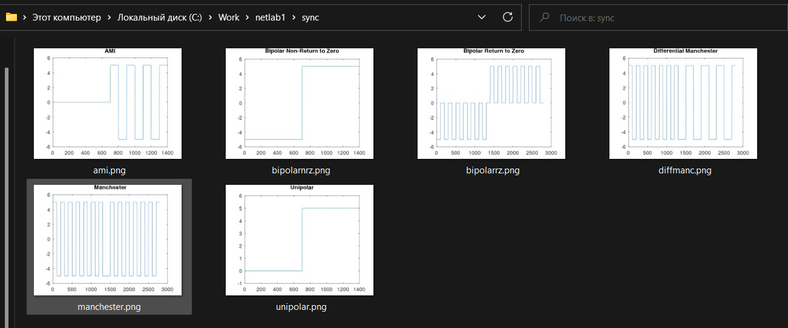{#fig-014}

В третьем каталоге - спектры кодировок сигналов.([рис. @fig-015])

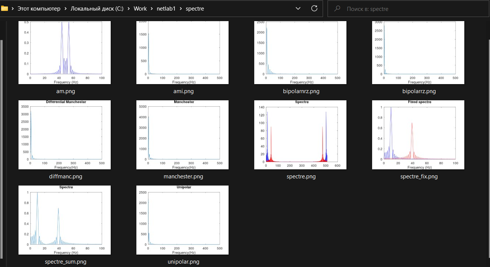{#fig-015}

# Выводы

В этой лабораторной работе я изучил высокоуровневый язык программирования Octave, а также различные методы кодирования и модуляции сигналов.
