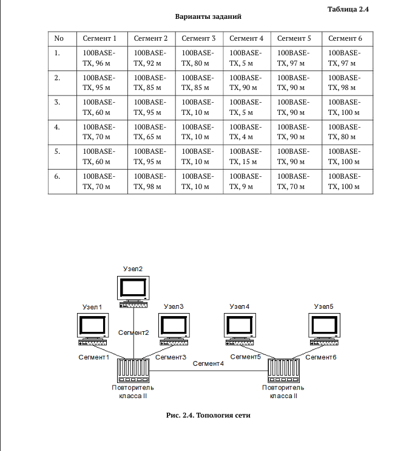
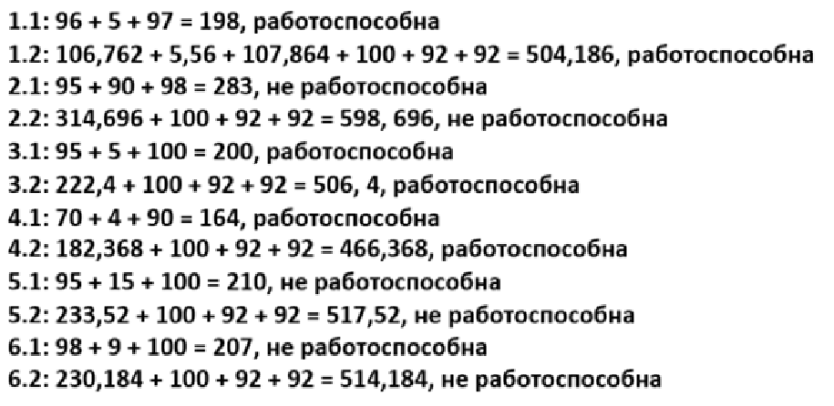

---
## Author
author:
  name: Гурылев Артем Андреевич
  email: 1132236135@pfur.ru
  affiliation:
    - name: Российский университет дружбы народов
## Title
title: Лабораторная работа №2
subtitle: Расчёт сети Fast Ethernet
license: CC BY
date: today
date-format: "YYYY-MM-DD"
---

# Информация

## Докладчик

  * Гурылев Артем Андреевич
  * Студент
  * Российский университет дружбы народов им. П. Лумумбы

## Цель работы

- Целью данной лабораторной работы является изучение принципов технологий Ethernet и Fast Ethernet и практическое освоение методик оценки работоспособности сети, построенной на базе технологии Fast Ethernet.

# Выполнение лабораторной работы

##

{height=80%}

##

{height=80%}

## Выводы

В этой лабораторной работе я изучил принципы технологий Ethernet и Fast Ethernet, и оценил работоспособность сетей по двум моделям.

