---
## Author
author:
  name: Гурылев Артем Андреевич
  email: 1132236135@pfur.ru
  affiliation:
    - name: Российский университет дружбы народов

## Title
title: "Лабораторная работа №3"
subtitle: "Анализ трафика в Wireshark"
license: "CC BY"
---

# Цель работы

Целью данной лабораторной работы является изучение посредством Wireshark кадров Ethernet, анализ PDU протоколов транспортного и прикладного уровней стека TCP/IP.

# Выполнение лабораторной работы

С помощью команды ipconfig определим MAC-адрес адаптера и адрес шлюза по умолчанию.([рис. @fig-001])

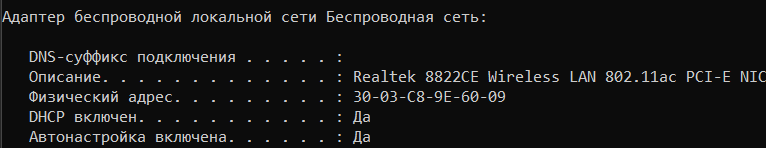{#fig-001}

Включив захват трафика, пропингуем шлюз.([рис. @fig-002])

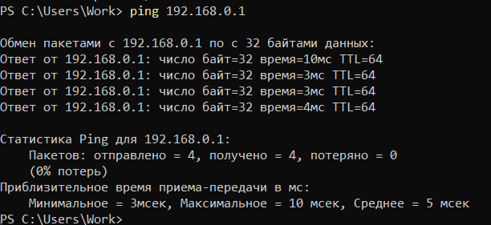{#fig-002}

В захвате трафика появились arp-пакеты.([рис. @fig-003])

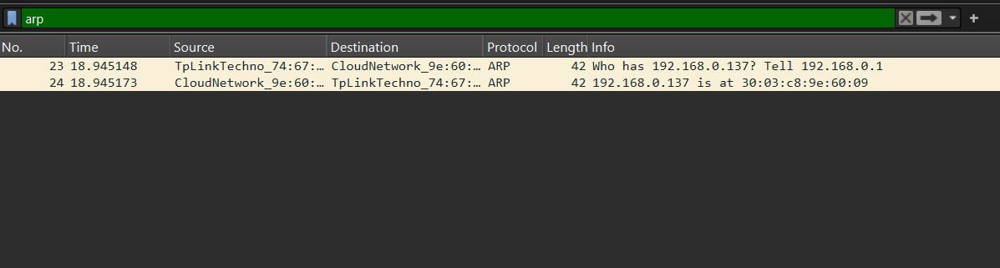{#fig-003}

Также там появились icmp-пакеты, которые соответствуют нашему пингу.([рис. @fig-004])

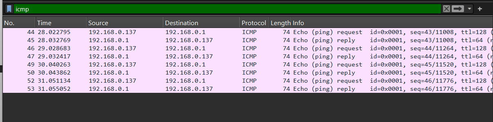{#fig-004}

Посмотрим панель сведений на пакете запроса ping.([рис. @fig-005])

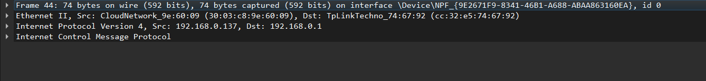{#fig-005}

Посмотрим панель сведений на пакете ответа ping.([рис. @fig-006])

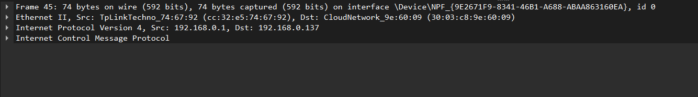{#fig-006}

Посмотрим панель сведений на arp-пакете.([рис. @fig-007])

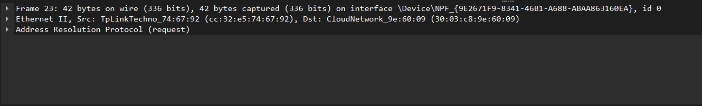{#fig-007}

Теперь пропингуем любой сайт - я выбрал google.com.([рис. @fig-008])

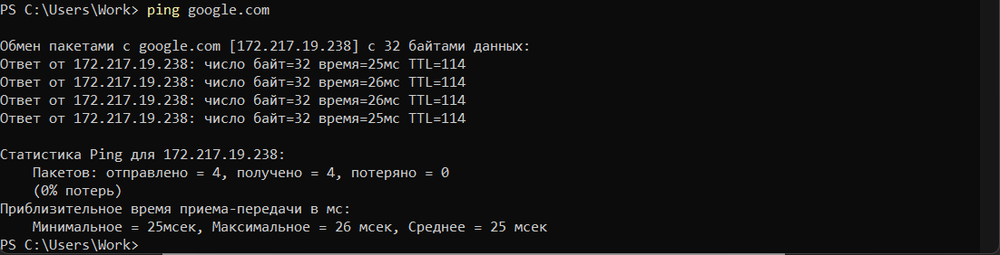{#fig-008}

Wireshark также захватил arp-пакеты.([рис. @fig-009])

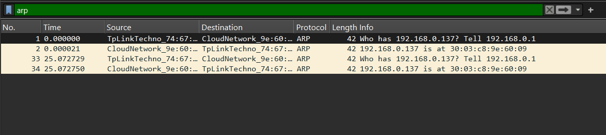{#fig-009}

В захвате трафика в том числе появились icmp-пакеты, соответствующие пингу сайта.([рис. @fig-010])

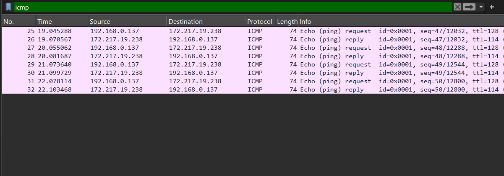{#fig-010}

Посмотрим панель сведений на пакете запроса ping.([рис. @fig-011])

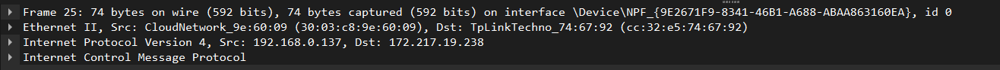{#fig-011}

Теперь зайдем на http сайт, и посмотрим захваченные пакеты этого протокола.([рис. @fig-012])

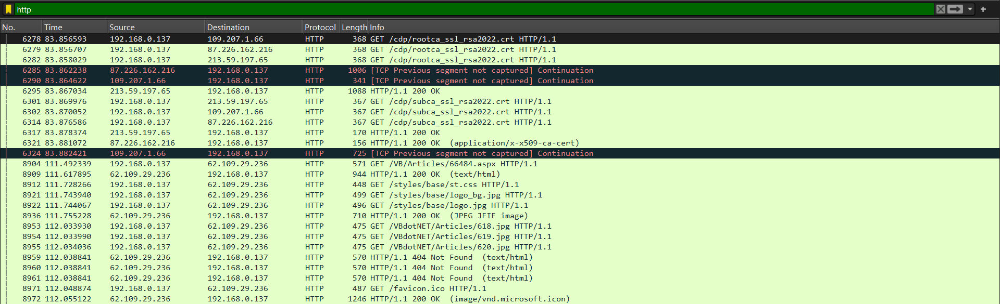{#fig-012}

Посмотрим панель сведений на пакете http запроса.([рис. @fig-013])

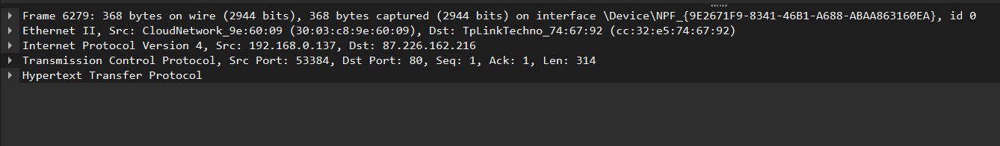{#fig-013}

Посмотрим DNS пакеты, захваченные программой.([рис. @fig-014])

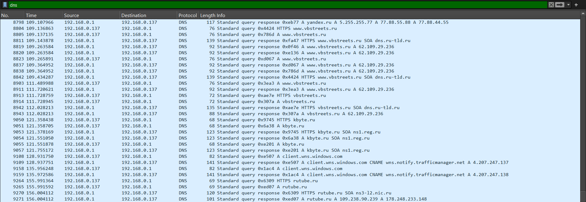{#fig-014}

Посмотрим панель сведений на DNS пакете.([рис. @fig-015])

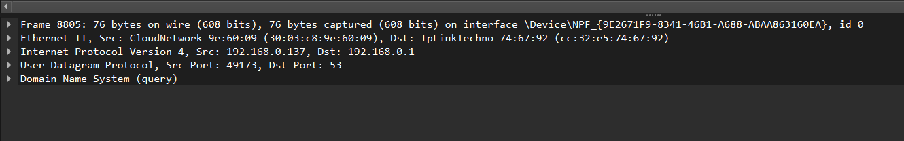{#fig-015}

Посмотрим захваченные QUIC пакеты.([рис. @fig-016])

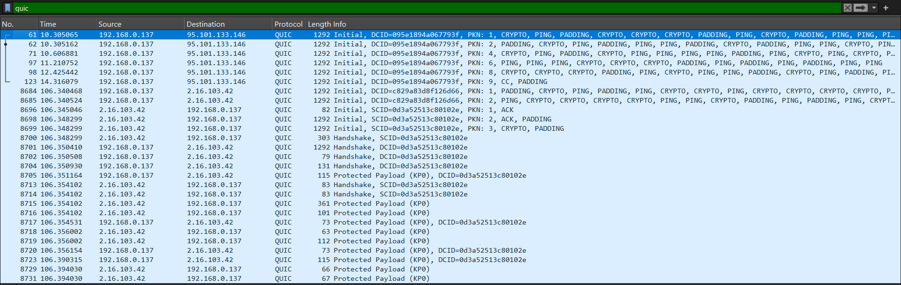{#fig-016}

Посмотрим панель сведений на quic пакете.([рис. @fig-017])

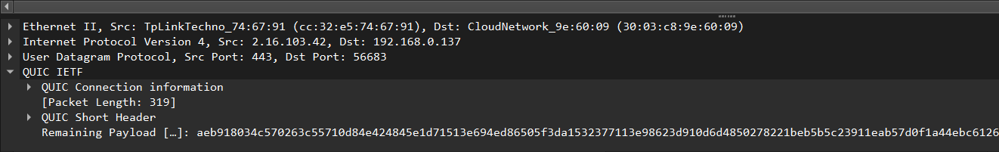{#fig-017}

Посмотрим захваченные TCP пакеты при захождении на сайт.([рис. @fig-018])

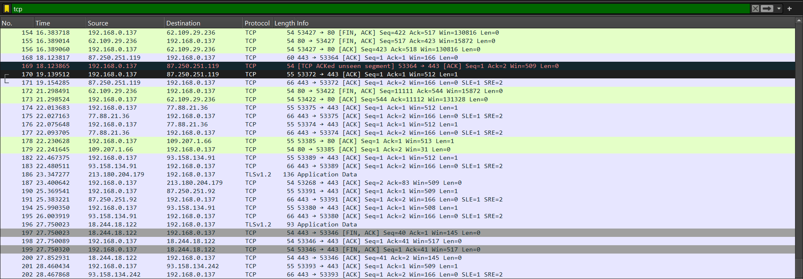{#fig-018}

Включим график потока, чтобы подробнее наблюдать за поведением TCP пакетов.([рис. @fig-019])

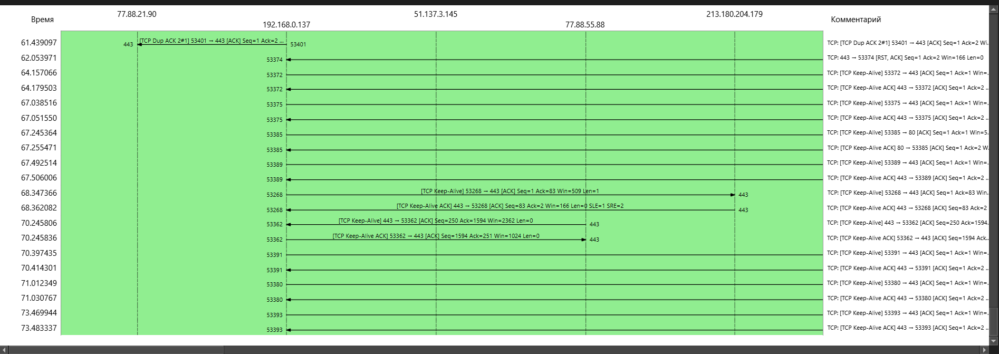{#fig-019}

# Выводы

В этой лабораторной работе я приобрел навыки работы с программой Wireshark.
