---
## Author
author:
  name: Гурылев Артем Андреевич
  email: 1132236135@pfur.ru
  affiliation:
    - name: Российский университет дружбы народов

## Title
title: "Лабораторная работа №4"
subtitle: "Подготовка экспериментального стенда GNS3"
license: "CC BY"
---

# Цель работы

Целью данной лабораторной работы является установка и настройка GNS3 и сопутствующего программного обеспечения.

# Выполнение лабораторной работы

Установим gns3 через Chocolatey.([рис. @fig-001])

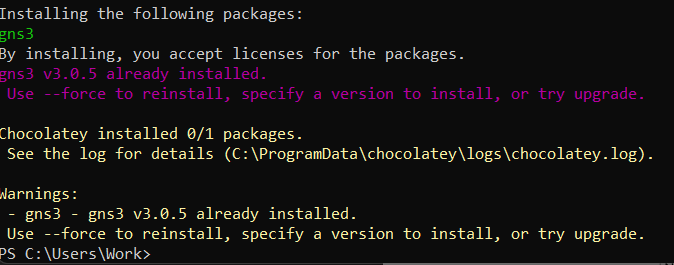{#fig-001}

Импортируем образ в VirtualBox.([рис. @fig-002])

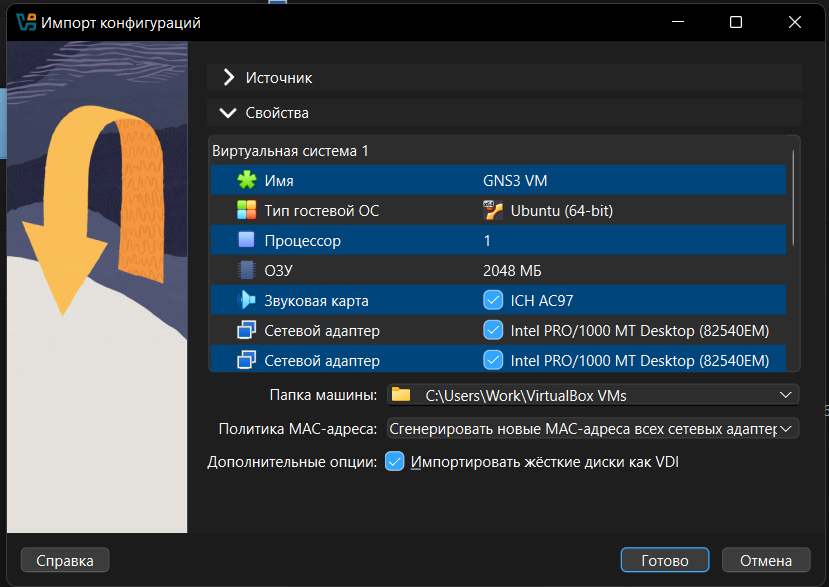{#fig-002}

Убедимся, что виртуальная машина правильно настроена.([рис. @fig-003])

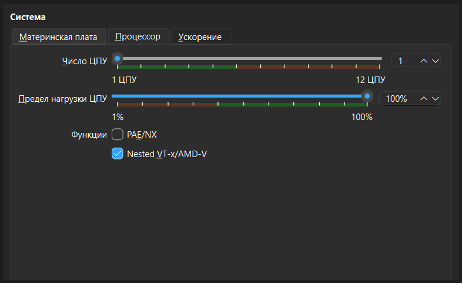{#fig-003}

Включим виртуализацию у образа.([рис. @fig-004])

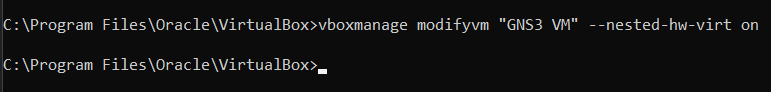{#fig-004}

Убедимся, что в настройках сетевого адаптера всё правильно.([рис. @fig-005])

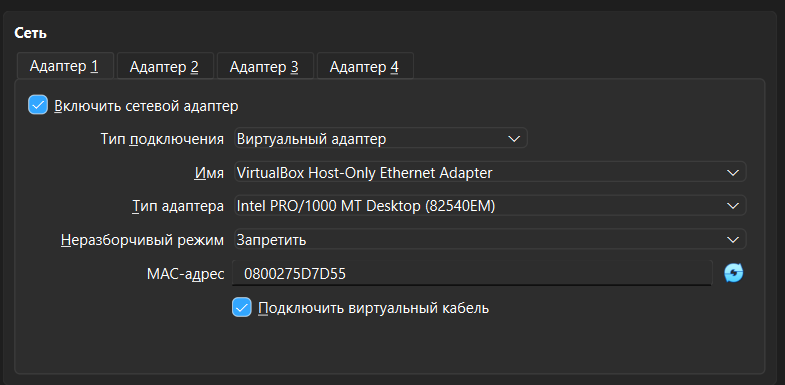{#fig-005}

Перейдём к установке клиента gns3 и настроим подключение к виртуальной машине.([рис. @fig-006])

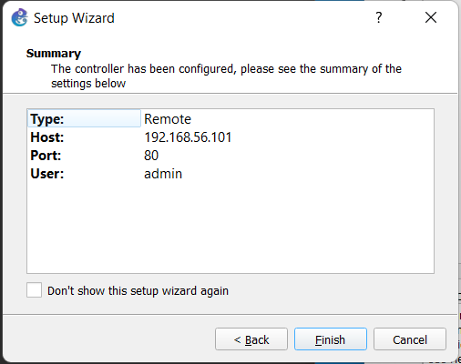{#fig-006}

Включим виртуальную машину.([рис. @fig-007])

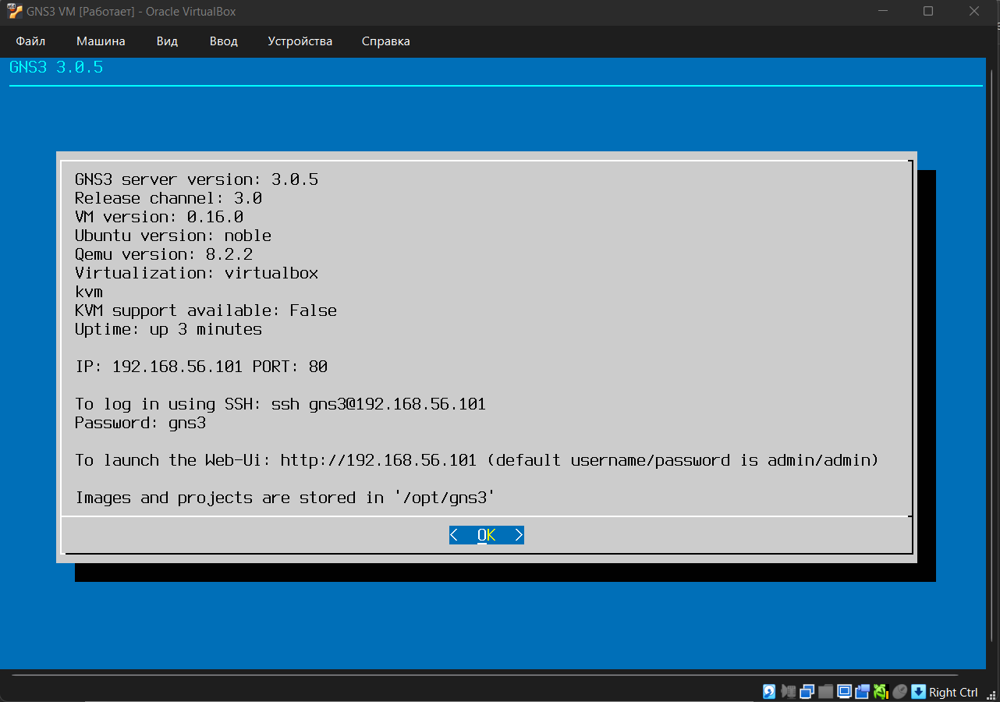{#fig-007}

Настроим клиент по нашим предпочтениям.([рис. @fig-008])

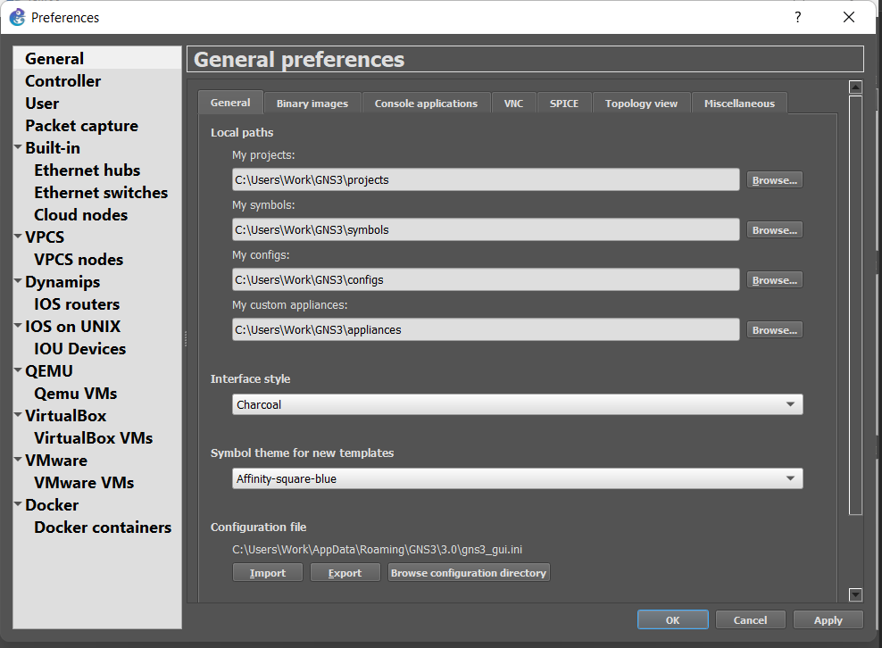{#fig-008}

Перейдём к установке маршрутизаторов.([рис. @fig-009])

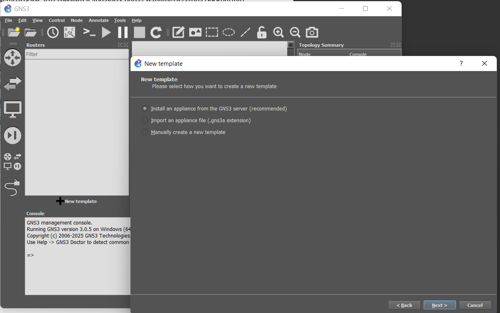{#fig-009}

Выберем FRR.([рис. @fig-010])

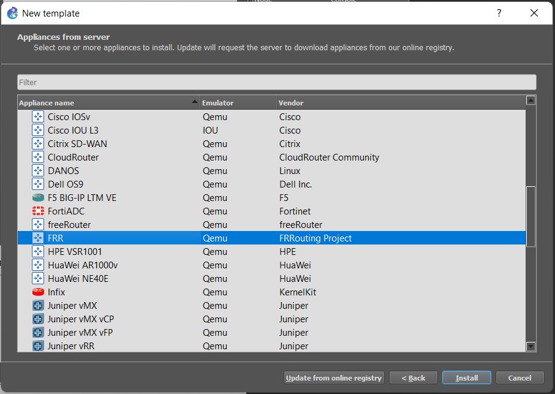{#fig-010}

Установим последнюю версию.([рис. @fig-011])

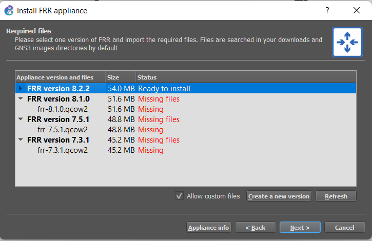{#fig-011}

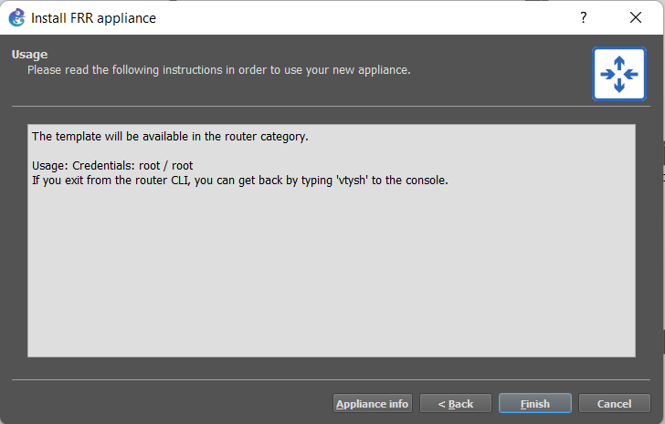{#fig-012}

Маршрутизатор появился в меню после установки.([рис. @fig-013])

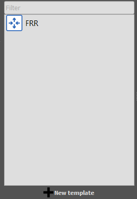{#fig-013}

Дополнительно настроим маршрутизатор FRR.([рис. @fig-014])

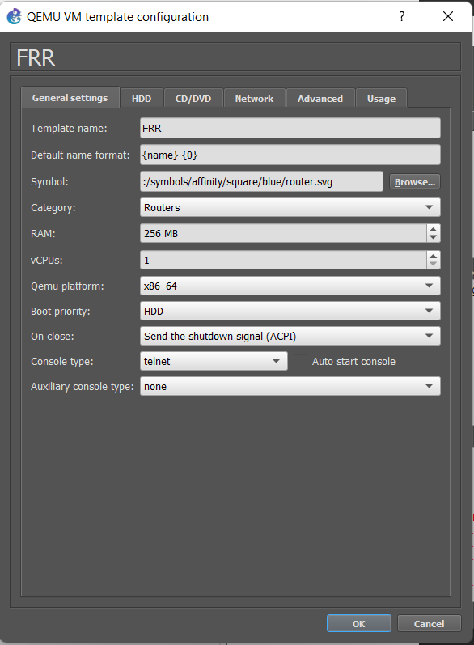{#fig-014}

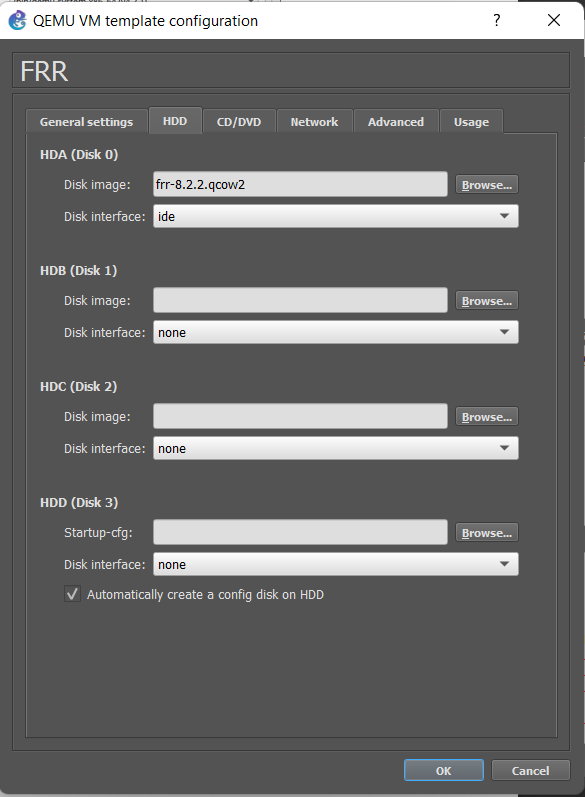{#fig-015}

Теперь установим маршрутизатор VyOS.([рис. @fig-016])

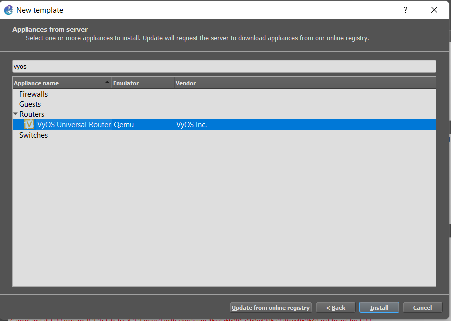{#fig-016}

Выберем нужную версию.([рис. @fig-017])

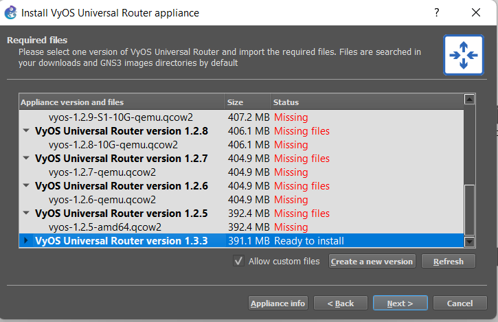{#fig-017}

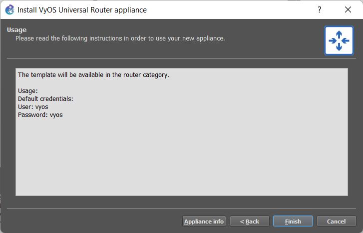{#fig-018}

Дополнительно для маршрутизатора установим QEMU.([рис. @fig-019])

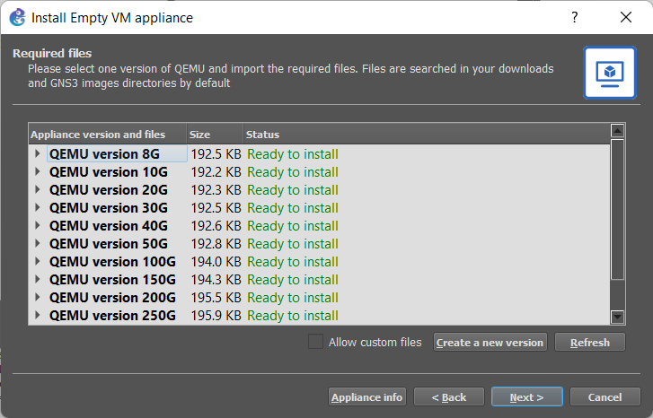{#fig-019}

Настроим маршрутизатор VyOS нужным образом.([рис. @fig-020])

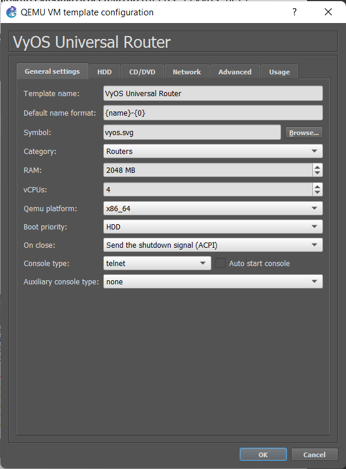{#fig-020}

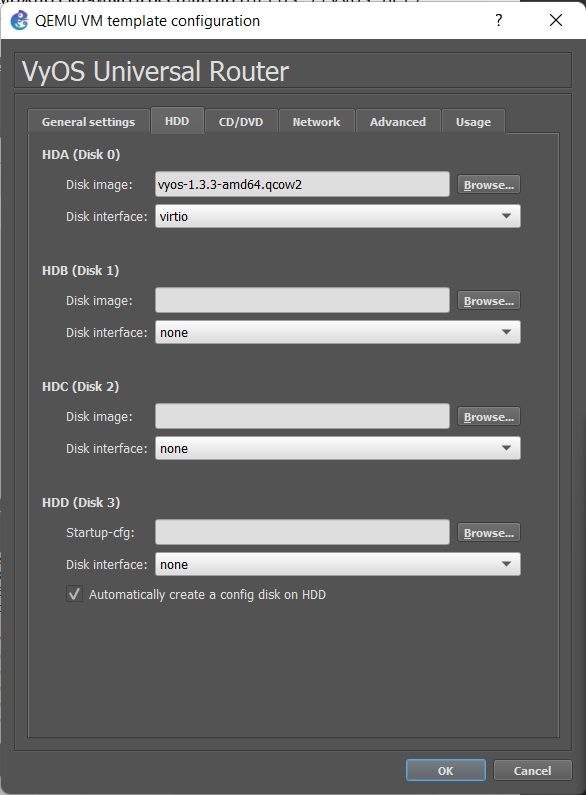{#fig-021}

# Выводы

В этой лабораторной работе я установил и настроил GNS3 вместе с сопутствующим программным обеспечением.
