---
## Author
author:
  name: Гурылев Артем Андреевич
  email: 1132236135@pfur.ru
  affiliation:
    - name: Российский университет дружбы народов

## Title
title: "Лабораторная работа №5"
subtitle: "Простые сети в GNS3. Анализ трафика"
license: "CC BY"
---

# Цель работы

Целью данной лабораторной работы является построение простейших моделей сети на базе коммутатора и маршрутизаторов FRR и VyOS в GNS3, анализ трафика посредством Wireshark.

# Выполнение лабораторной работы

Создадим топологию сети в gns3.([рис. @fig-001])

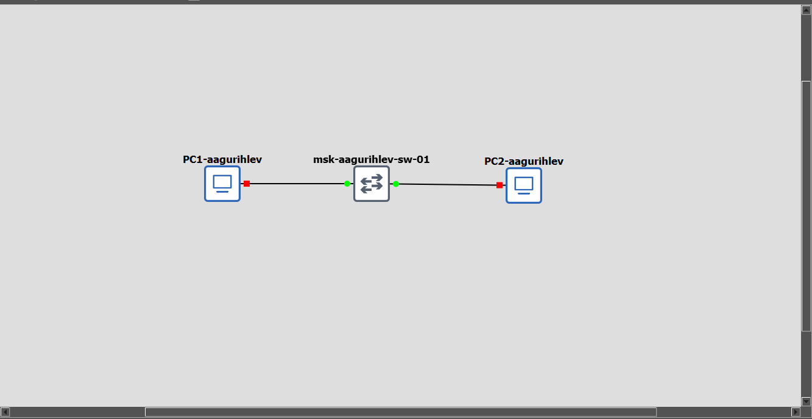{#fig-001}

Установим ip-адрес для PC1.([рис. @fig-002])

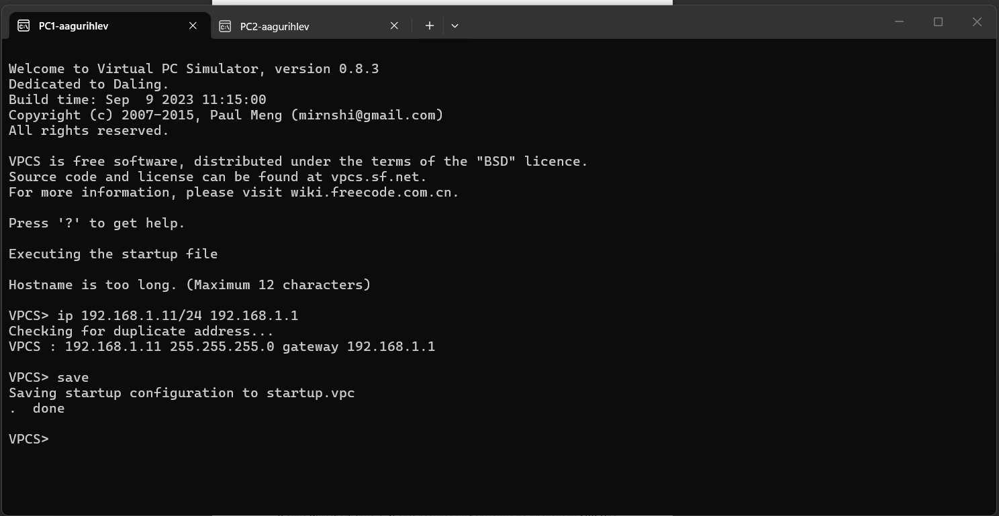{#fig-002}

Установим ip-адрес для PC2.([рис. @fig-003])

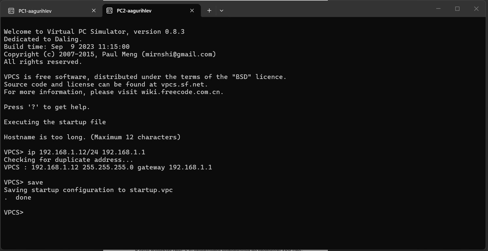{#fig-003}

Сделаем пинг от PC1 к PC2.([рис. @fig-004])

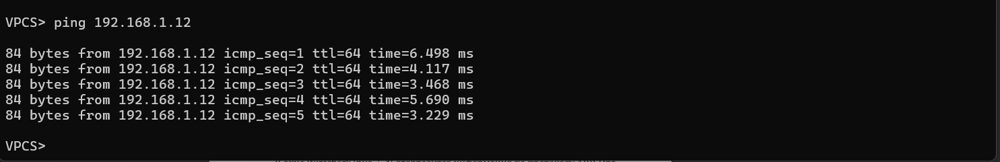{#fig-004}

Сделаем тоже самое, но в режиме ICMP.([рис. @fig-005])

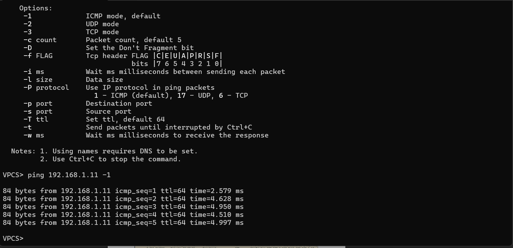{#fig-005}

Посмотрим на захваченные пакеты ICMP на соединении.([рис. @fig-006])

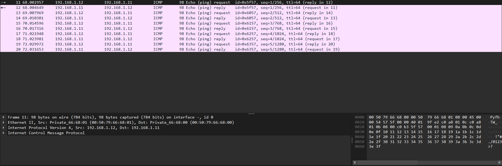{#fig-006}

Сделаем пинг от PC1 к PC2 в режиме UDP.([рис. @fig-007])

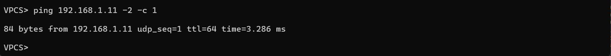{#fig-007}

Посмотрим на захваченные пакеты UDP на соединении.([рис. @fig-008])

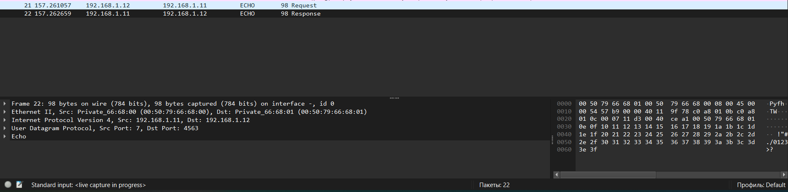{#fig-008}

Сделаем пинг от PC1 к PC2 в режиме TCP, и посмотрим на захваченный трафик.([рис. @fig-009])

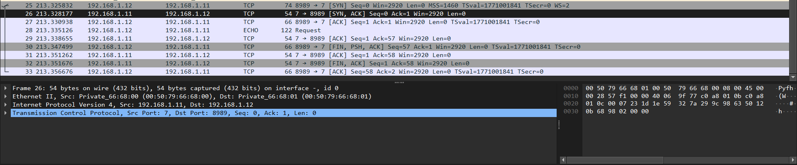{#fig-009}

Создадим сеть с FRR маршрутизатором.([рис. @fig-010])

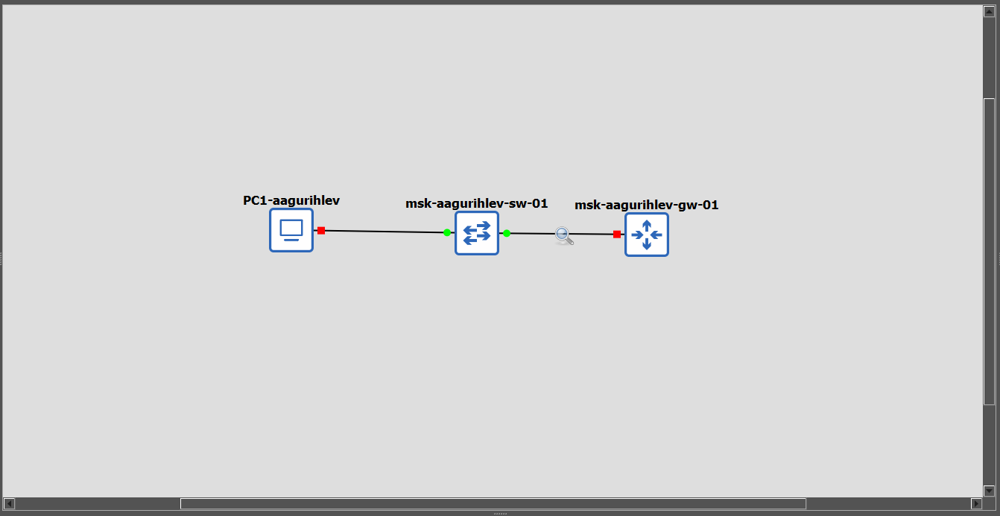{#fig-010}

Установим ip-адрес для PC1.([рис. @fig-011])

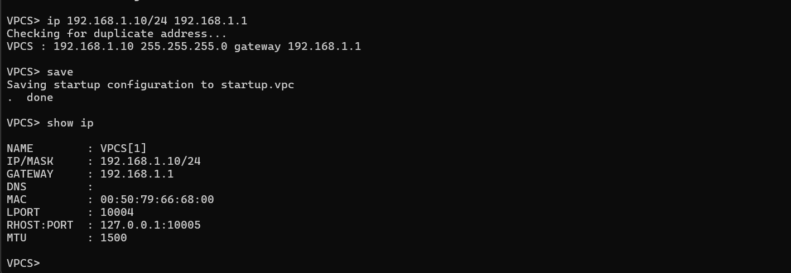{#fig-011}

Сконфигурируем маршрутизатор.([рис. @fig-012])

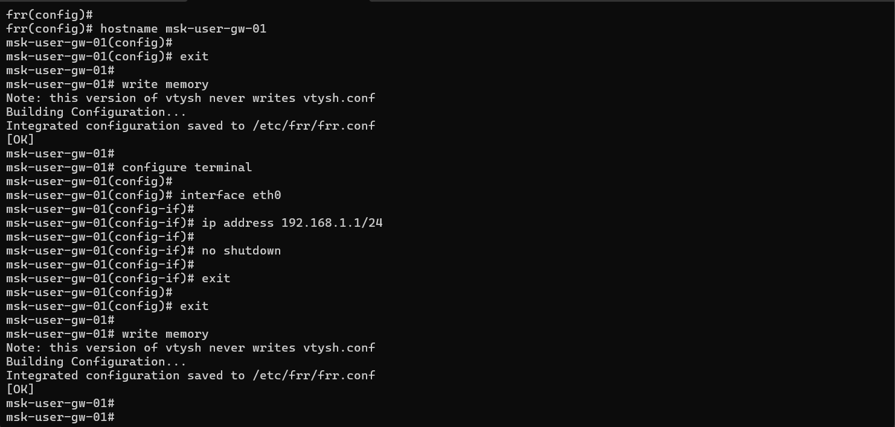{#fig-012}

После этого посмотрим, как изменилась его конфигурация.([рис. @fig-013])

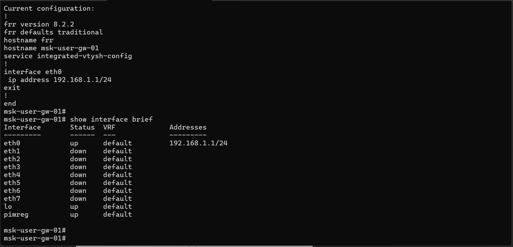{#fig-013}

Сделаем пинг от PC1 к маршрутизатору.([рис. @fig-014])

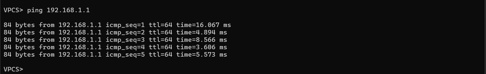{#fig-014}

Посмотрим на захваченный трафик.([рис. @fig-015])

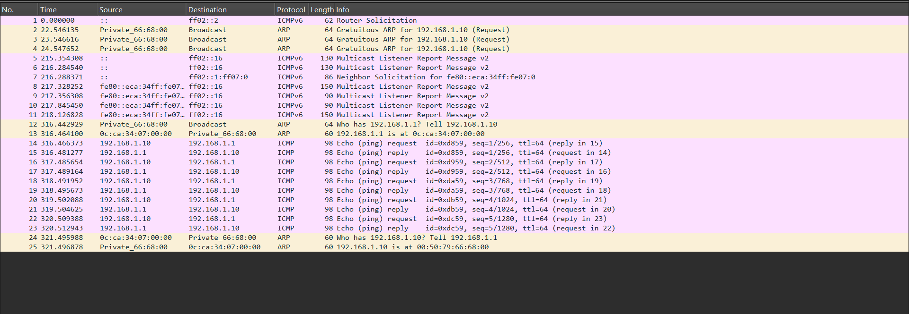{#fig-015}

Создадим сеть с маршрутизатором VyOS.([рис. @fig-016])

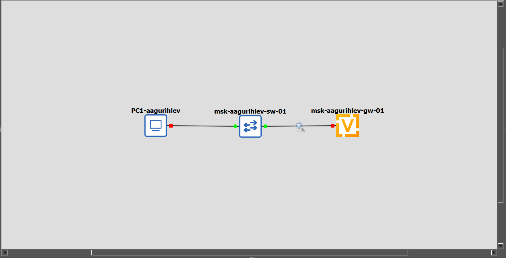{#fig-016}

Установим ip-адрес для PC1.([рис. @fig-017])

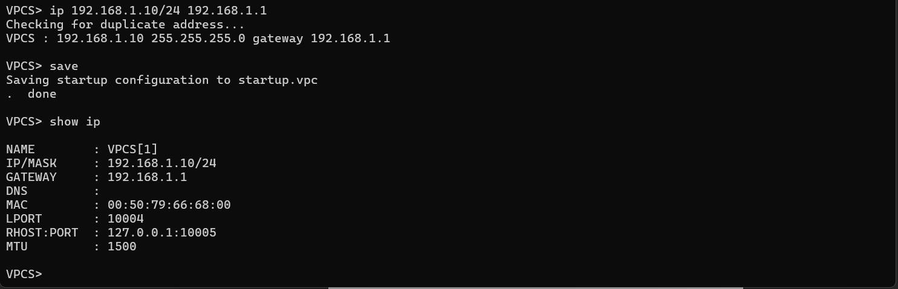{#fig-017}

Сконфигурируем маршрутизатор и после этого посмотрим его конфигурацию.([рис. @fig-018])

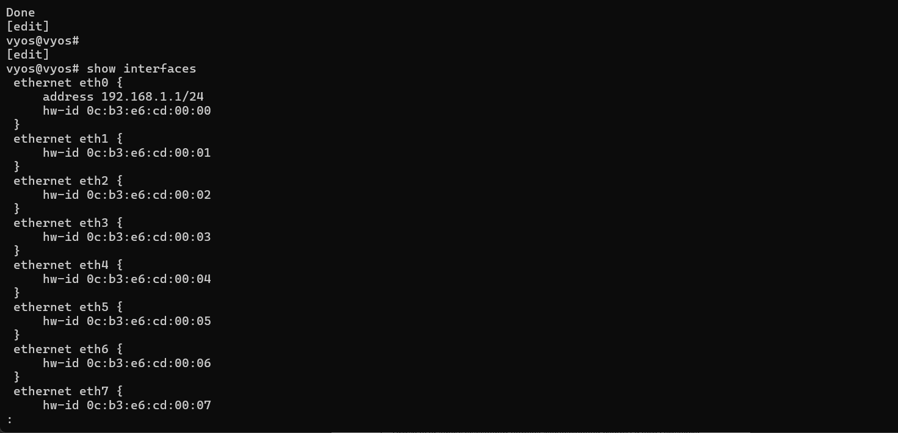{#fig-018}

Сделаем пинг от PC1 к маршрутизатору.([рис. @fig-019])

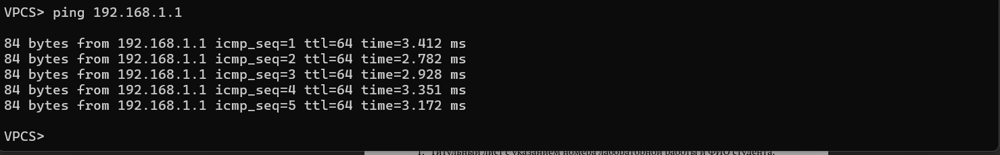{#fig-019}

Посмотрим на захваченный трафик.([рис. @fig-020])

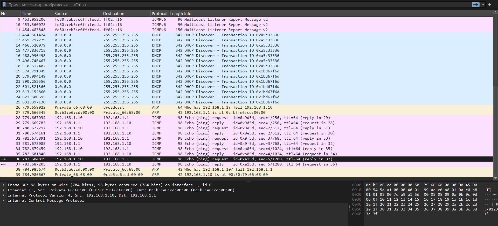{#fig-020}

# Выводы

В этой лабораторной работе я приобрел навыки построения простейших моделей сети.
