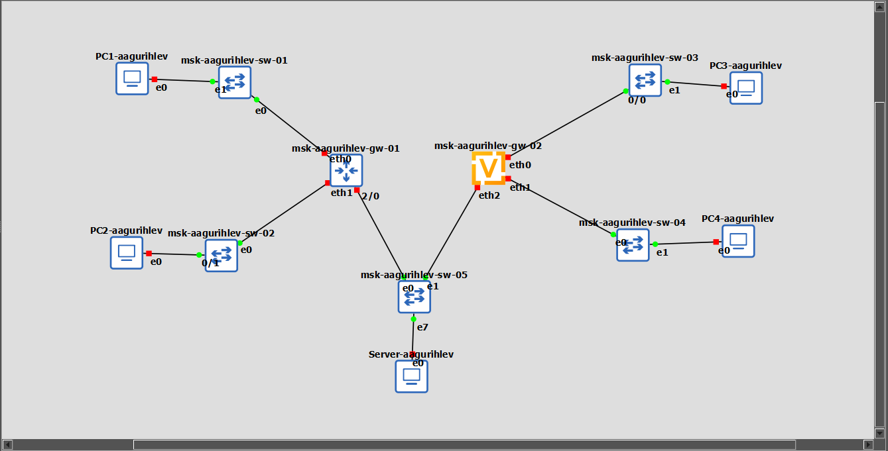
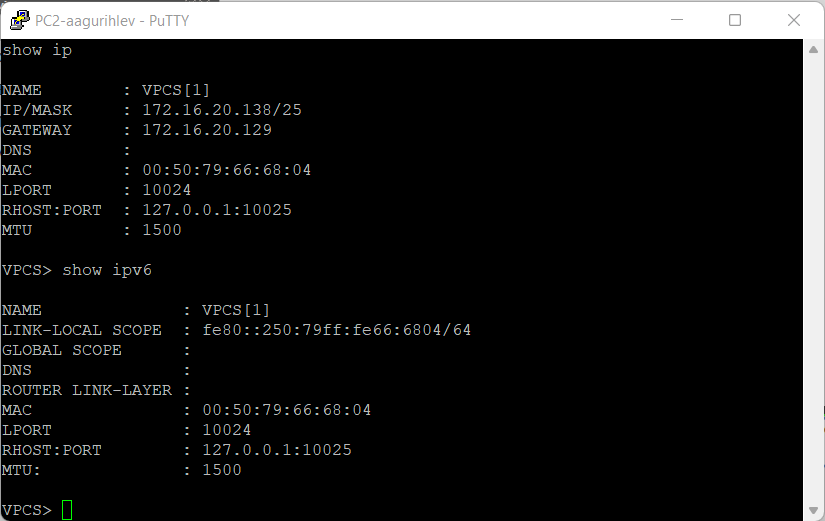
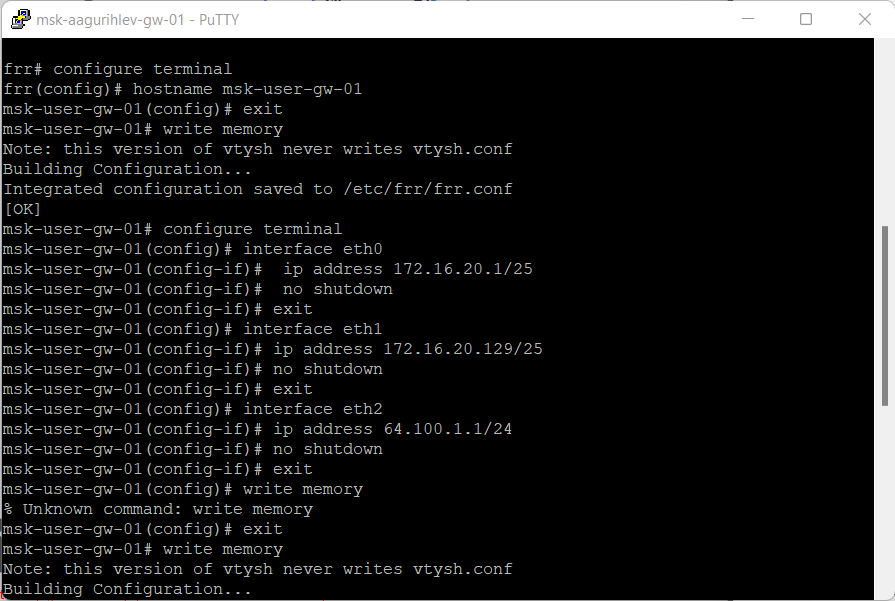
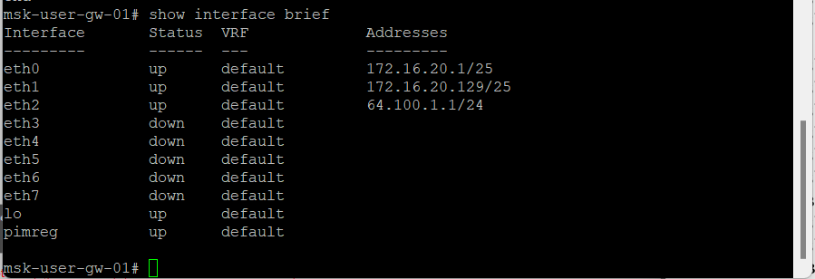
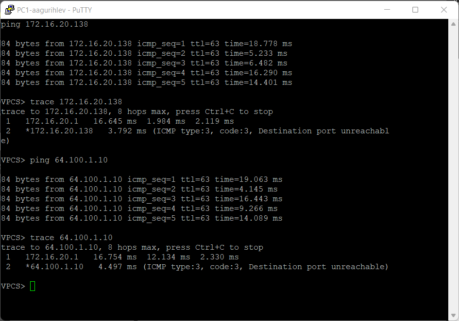
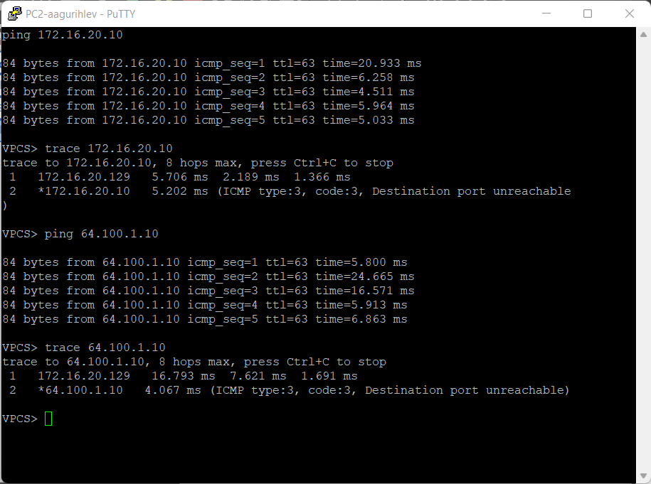
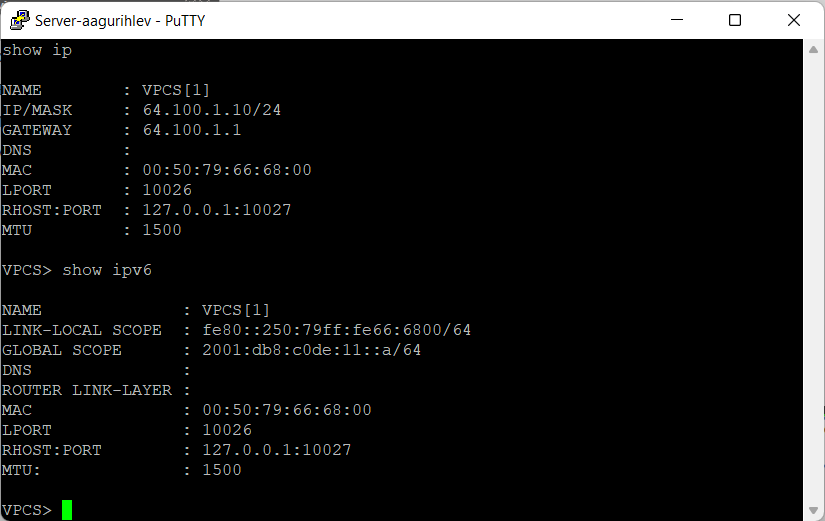
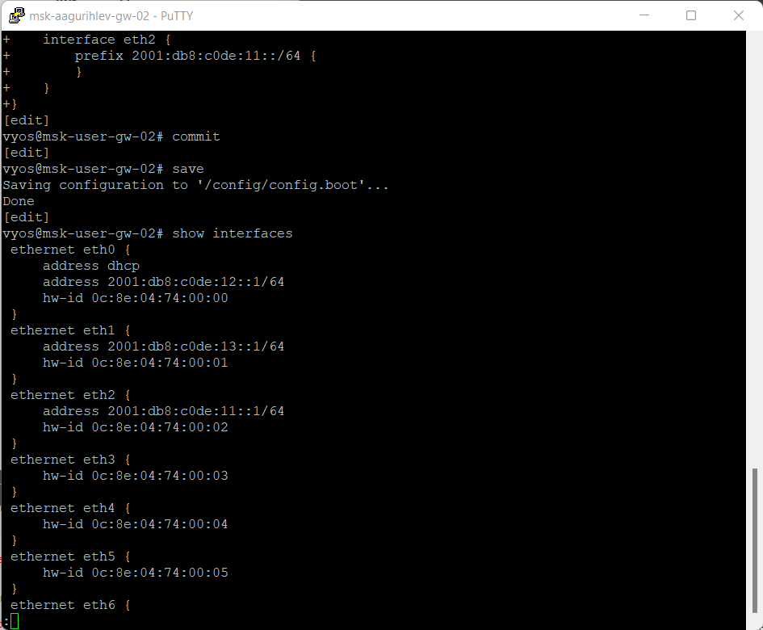
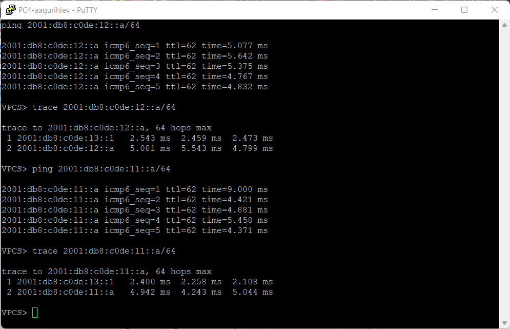

---
## Author
author:
  name: Гурылев Артем Андреевич
  email: 1132236135@pfur.ru
  affiliation:
    - name: Российский университет дружбы народов

## Title
title: "Лабораторная работа №6"
subtitle: "Адресация IPv4 и IPv6. Двойной стек"
license: "CC BY"
---

# Цель работы

Целью работы является изучение принципов распределения и настройки адресного пространства на устройствах сети.

# Выполнение лабораторной работы

Сделаем в GNS3 топологию сети, представленную на рисунке, а также выдадим идентичные имена, заменив user на логин. ([рис. @fig-001])

{#fig-001 height=80%}

Выдадим PC1 IPv4 адрес согласно таблице, и посмотрим информацию по адресам. ([рис. @fig-002])

{#fig-002 height=80%}

Выдадим PC2 IPv4 адрес согласно таблице, и посмотрим информацию по адресам. ([рис. @fig-003])

{#fig-003 height=80%}

После этого выдадим IPv4 адрес серверу двойного стека.

Начнем конфигурацию маршрутизатора FRR, дадим интерфейсам IPv4 согласно таблице, внесём изменения. ([рис. @fig-004])

{#fig-004 height=80%}

Просмотрим конфигурацию адресов маршрутизатора FRR. ([рис. @fig-005])

{#fig-005 height=80%}

Также просмотрим конфигурацию его интерфейсов. ([рис. @fig-006])

{#fig-006 height=80%}

Проверим соединение к PC2 и серверу с PC1. ([рис. @fig-007])

{#fig-007 height=80%}

Проверим соединение к PC1 и серверу с PC2. ([рис. @fig-008])

{#fig-008 height=80%}

Перейдём к настройке подсети IPv6.

Выдадим PC3 IPv6 адрес согласно таблице, и посмотрим информацию по адресам. ([рис. @fig-009])

{#fig-009 height=80%}

Выдадим PC4 IPv6 адрес согласно таблице, и посмотрим информацию по адресам. ([рис. @fig-010])

{#fig-010 height=80%}

Выдадим серверу IPv6 адрес согласно таблице, и посмотрим информацию по адресам. ([рис. @fig-011])

{#fig-011 height=80%}

Начнем настройку маршрутизатора VyOS. Изменим имя его хоста: ([рис. @fig-012])

{#fig-012 height=80%}

Изменим конфигурацию интерфейсов согласно таблице, выдадим им IPv6 адреса. ([рис. @fig-013])

{#fig-013 height=80%}

Внесём изменения и посмотрим интерфейсы маршрутизатора VyOS. ([рис. @fig-014])

{#fig-014 height=80%}

Проверим соединение к PC4 и серверу с PC3. ([рис. @fig-015])

{#fig-015 height=80%}

Проверим соединение к PC3 и серверу с PC4. ([рис. @fig-016])

{#fig-016 height=80%}

Убедимся, что устройства из разных подсетей не доступны друг для друга. Из подсети IPv6: ([рис. @fig-017])

{#fig-017 height=80%}

И также из подсети IPv4. ([рис. @fig-018])

{#fig-018 height=80%}

Серверу же доступны PC из обеих подсетей. ([рис. @fig-019])

{#fig-019 height=80%}

Посмотрим на захваченный трафик. В нём можно увидеть, какой ip отправлял какому запросы, по какому протоколу, а также небольшую информацию о самом запросе - например, эхо ли это запрос, или broadcast. ([рис. @fig-020])

{#fig-020 height=80%}

# Выводы

В этой лабораторной работе были получены навыки настройки адресного пространства в GNS3.