---
## Author
author:
  name: Гурылев Артем Андреевич
  email: 1132236135@pfur.ru
  affiliation:
    - name: Российский университет дружбы народов
## Title
title: Лабораторная работа №1
subtitle: Подготовка лабораторного стенда
license: CC BY
date: today
date-format: "YYYY-MM-DD"
---

# Информация

## Докладчик

  * Гурылев Артем Андреевич
  * Студент
  * Российский университет дружбы народов им. П. Лумумбы

## Цель работы

- Целью данной лабораторной работы является

# Выполнение лабораторной работы

## Топология сети

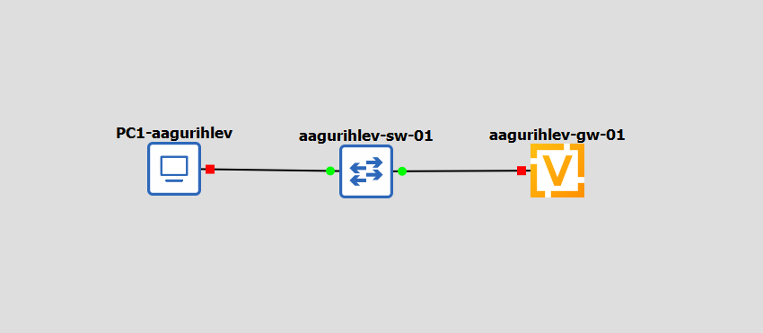{height=80%}

## Создание пользователя в маршрутизаторе

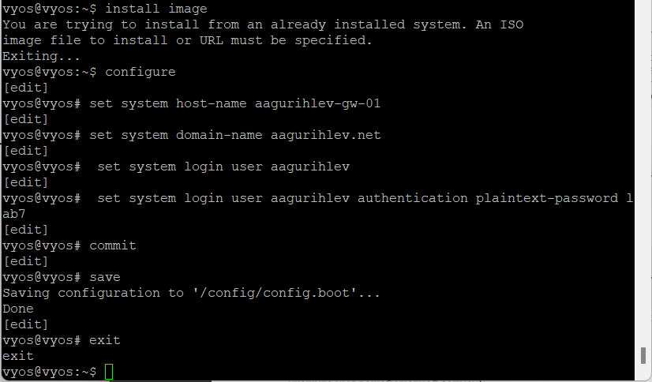{height=80%}

## Удаление пользователя по умолчанию

{height=80%}

## Настройка dhcp-сервера в маршрутизаторе

{height=80%}

## Настройка DHCP в PC1

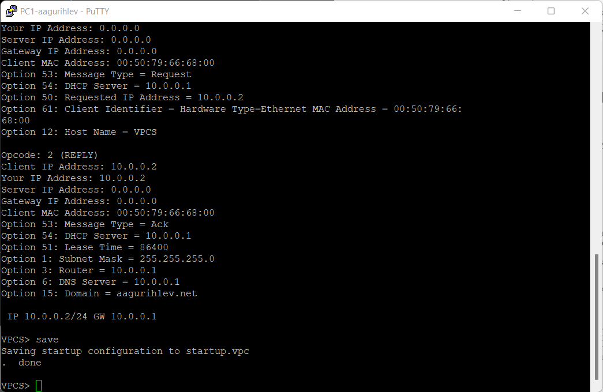{height=80%}

## Пинг маршрутизатора с PC1

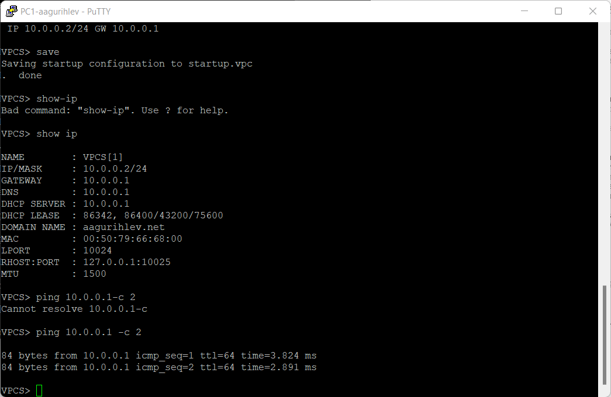{height=80%}

## Статистика DHCP-сервера

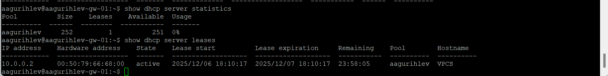{height=80%}

## Лог работы DHCP-сервера

{height=80%}

## Захваченные пакеты

{height=80%}

## Расширенная топология сети

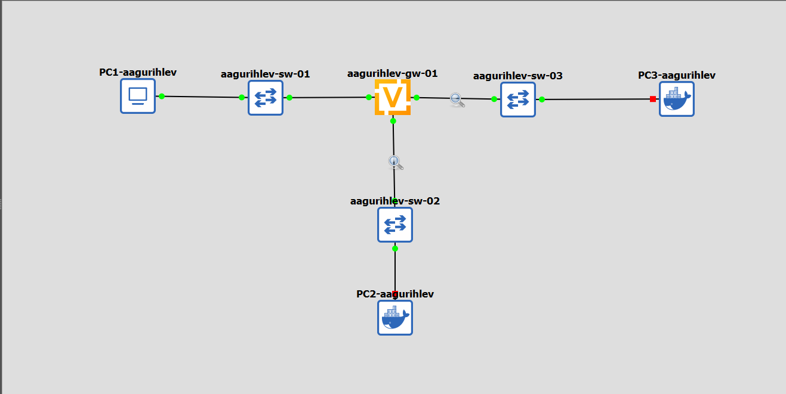{height=80%}

## Настройка IPv6 маршрутизатора

{height=80%}

## Конфигурация DHCPv6 сервера на маршрутизаторе

{height=80%}

## Настройки сети PC2

{height=80%}

## Пинг маршрутизатора с PC2

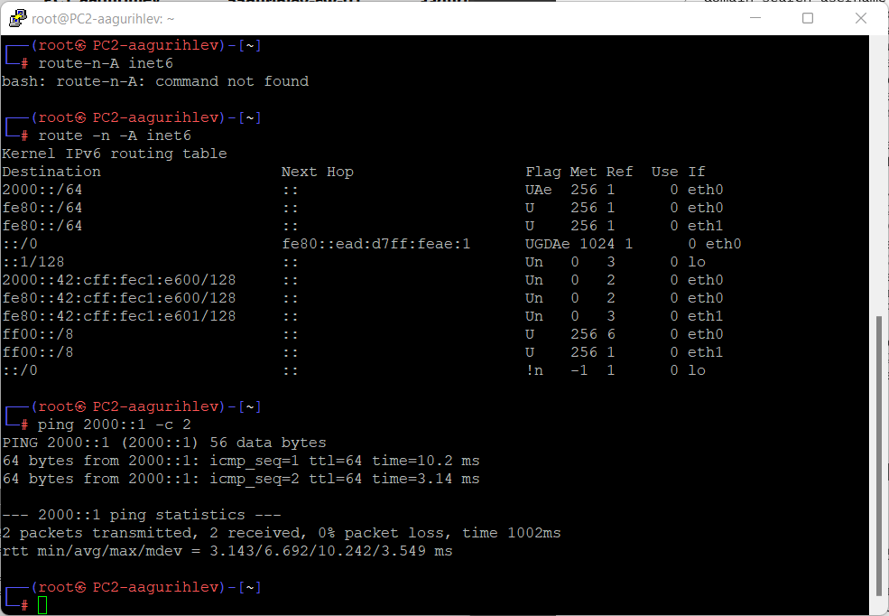{height=80%}

## Запрос IPv6 адреса у сервера

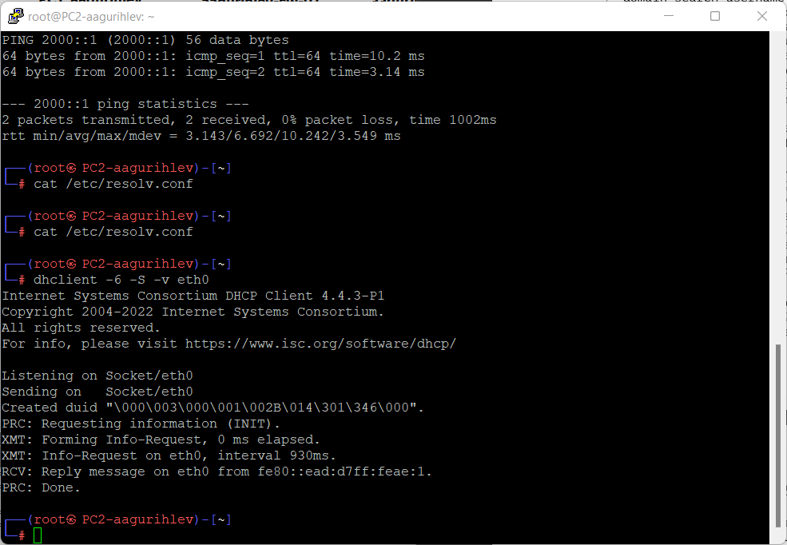{height=80%}

## Пинг маршрутизатора и настройки DNS PC2

{height=80%}

## Статистика DHCPv6 сервера

{height=80%}

## Захваченные пакеты

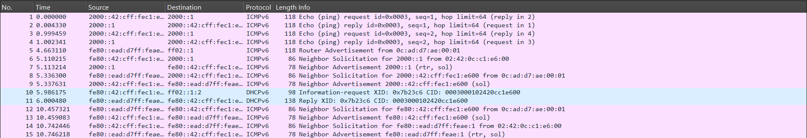{height=80%}

## Конфигурация stateful DHCPv6

{height=80%}

## Настройки сети PC3

{height=80%}

## Запрос адреса IPv6 у сервера

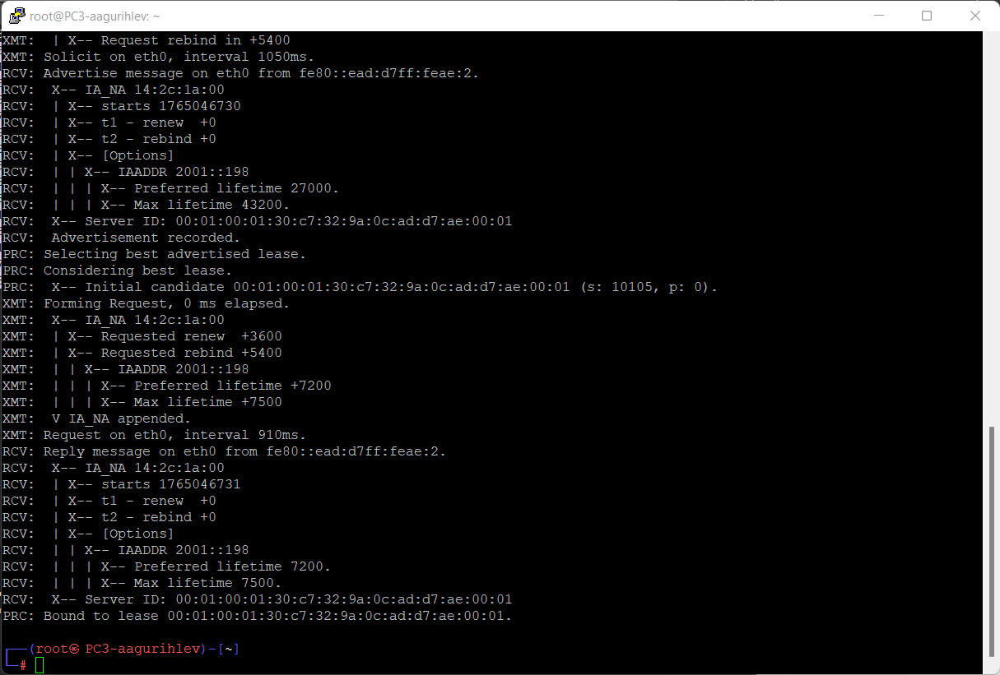{height=80%}

## Настройки сети, пинг и DNS настройки PC3

{height=80%}

## Статистика DHCPv6 сервера

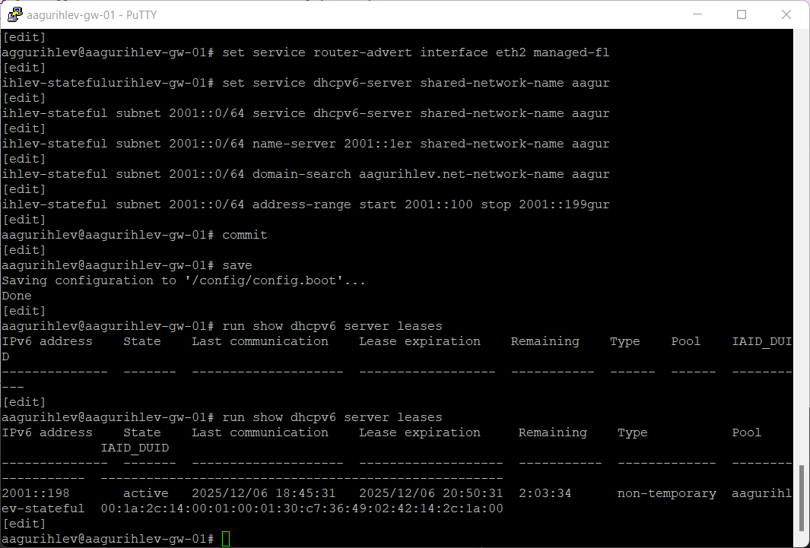{height=80%}

## Захваченные пакеты

{height=80%}

## Выводы

