---
## Author
author:
  name: Гурылев Артем Андреевич
  email: 1132236135@pfur.ru
  affiliation:
    - name: Российский университет дружбы народов

## Title
title: "Лабораторная работа №7"
subtitle: "Адресация IPv4 и IPv6. Настройка DHCP"
license: "CC BY"
---

# Цель работы

Целью этой лабораторной работы является получение навыков настройки службы DHCP на сетевом оборудовании для распределения адресов IPv4 и IPv6.

# Выполнение лабораторной работы

Настроим топологию сети в GNS3.([рис. @fig-001])

{#fig-001}

Загрузим маршрутизатор VyOS и создадим своего пользователя.([рис. @fig-002])

{#fig-002}

Удалим пользователя по умолчанию.([рис. @fig-003])

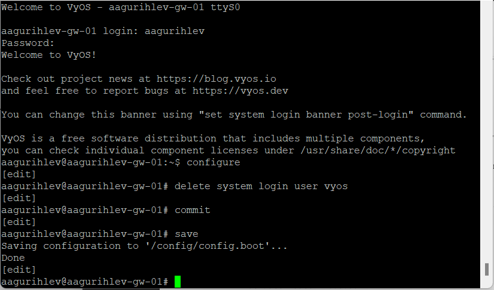{#fig-003}

Теперь настроим dhcp-сервер на маршрутизаторе, поменяв настройки адаптеров и образовав разделяемую сеть.([рис. @fig-004])

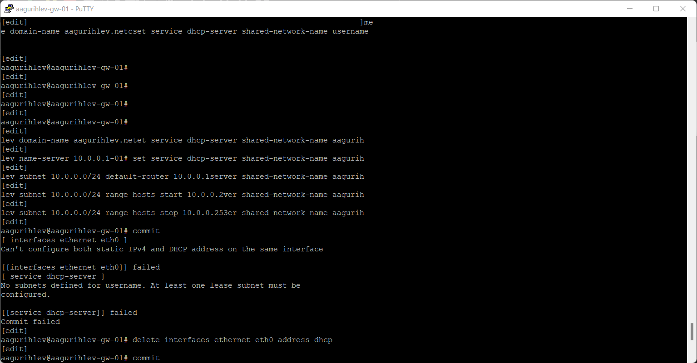{#fig-004}

Перейдем к PC1 и настроим его. Команда показывает нам разные запросы, которые может принимать клиент, и настройки, которые к каждому из этих запросов.([рис. @fig-005])

{#fig-005}

Теперь проведем пинг к маршрутизатору.([рис. @fig-006])

{#fig-006}

В статистике отобразилась информация о выданном IP адресе.([рис. @fig-007])

{#fig-007}

Посмотрим лог работы DHCP-сервера.([рис. @fig-008])

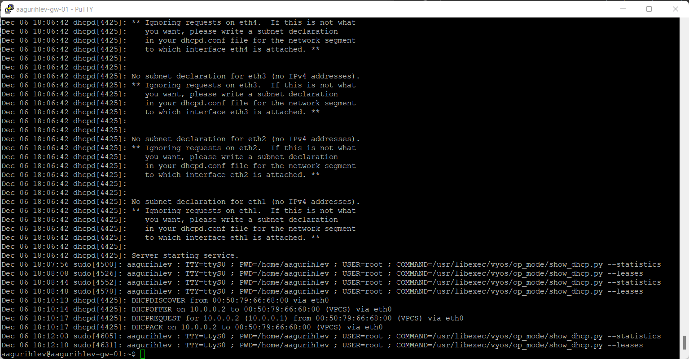{#fig-008}

Теперь посмотрим на захваченные пакеты между маршрутизатором и клиентом. Как можем увидеть, сервер обнаруживает клиент и выдаёт ему IP адрес из пула доступных.([рис. @fig-009])

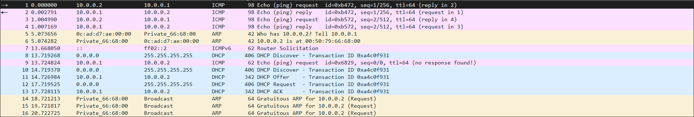{#fig-009}

Теперь дополним топологию сети, добавив ещё два клиента.([рис. @fig-010])

{#fig-010}

Начнем настройку маршрутизатора для IPv6.([рис. @fig-011])

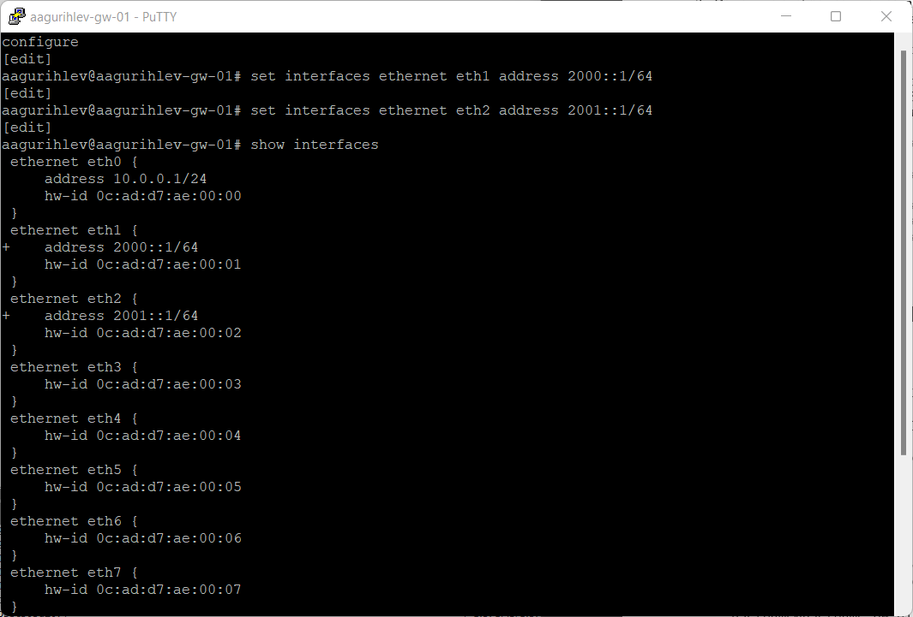{#fig-011}

Проведём настройку DHCPv6-сервера и проверим его конфигурацию.([рис. @fig-012])

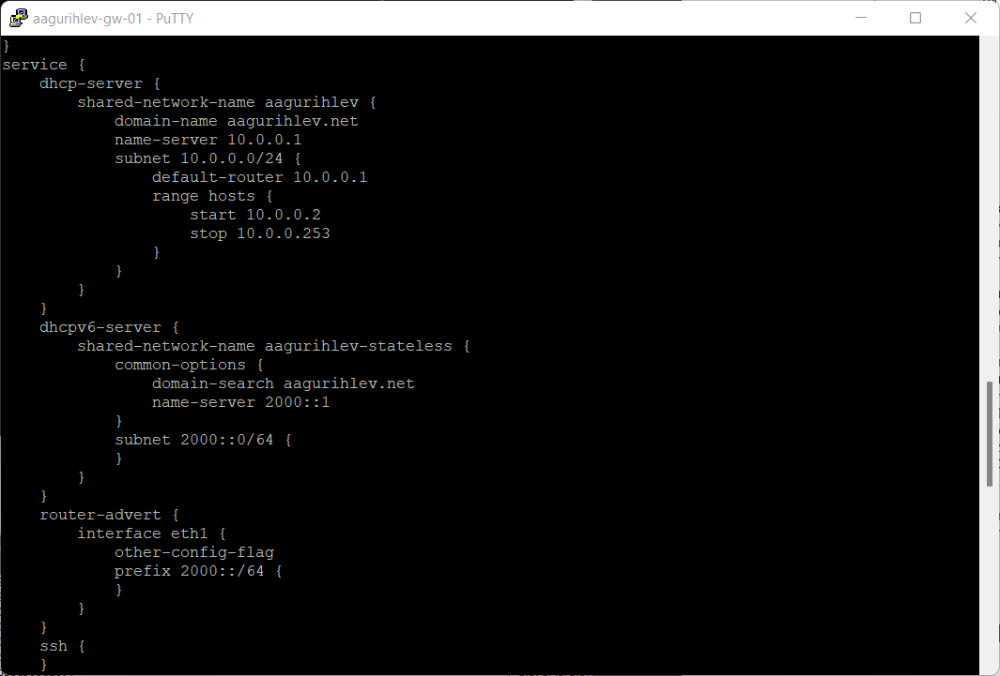{#fig-012}

Перейдём к PC2 и проверим его настройки сети.([рис. @fig-013])

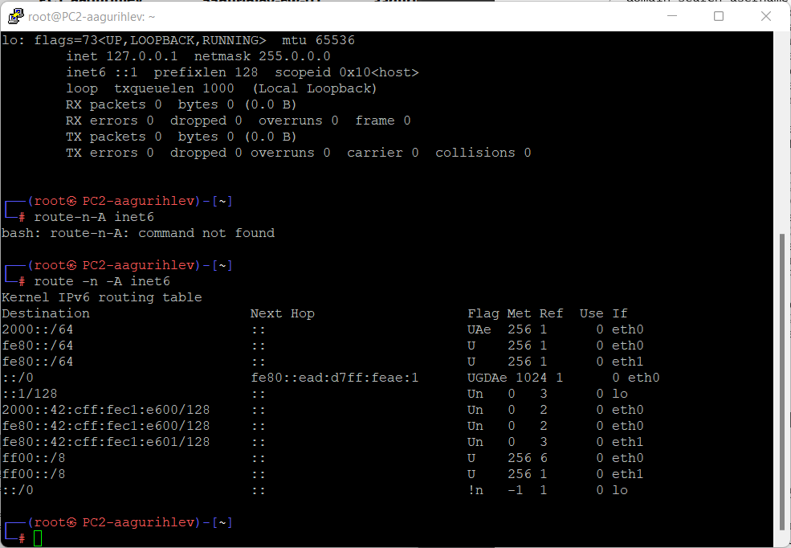{#fig-013}

Проведём пинг маршрутизатора с PC2.([рис. @fig-014])

{#fig-014}

Теперь запросим IPv6 адрес у сервера с помощью команды.([рис. @fig-015])

{#fig-015}

Снова пропингуем маршрутизатор и посмотрим настройки DNS у PC2.([рис. @fig-016])

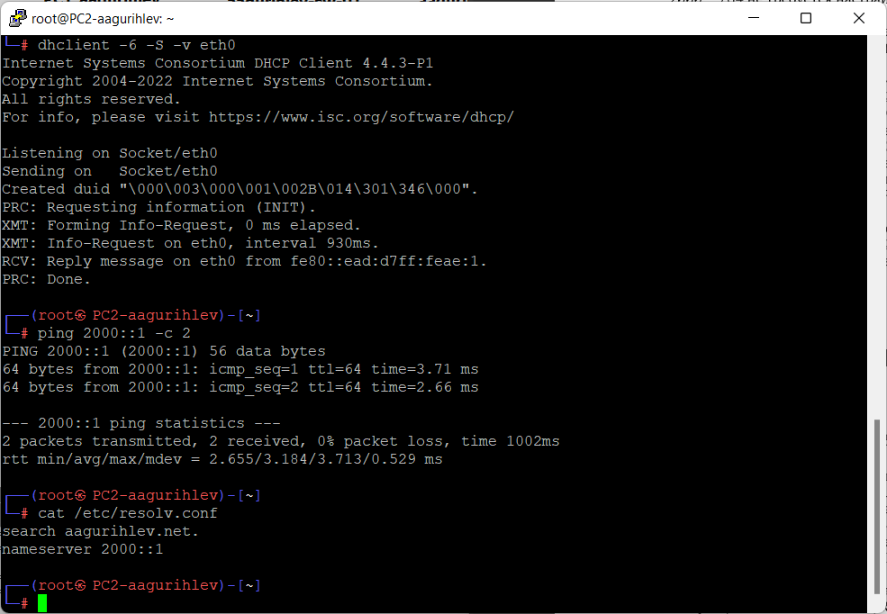{#fig-016}

([рис. @fig-017])

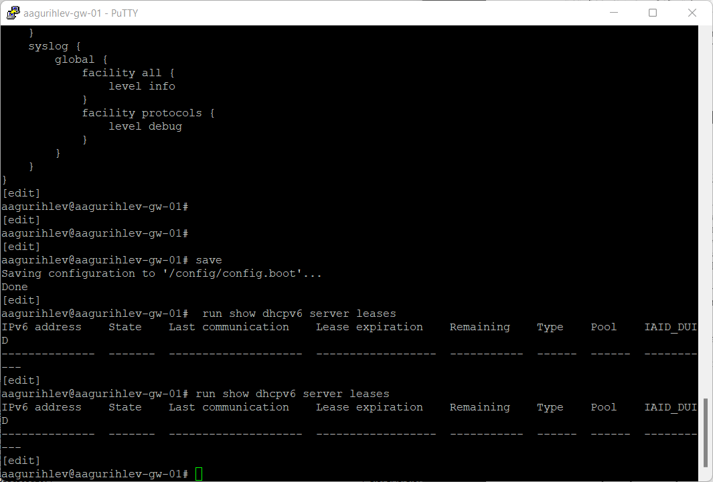{#fig-017}

([рис. @fig-018])

{#fig-018}

([рис. @fig-019])

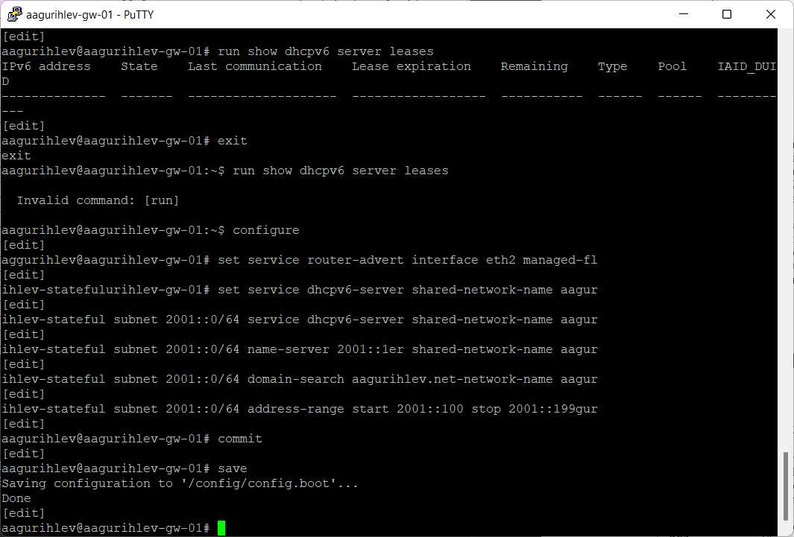{#fig-019}

([рис. @fig-020])

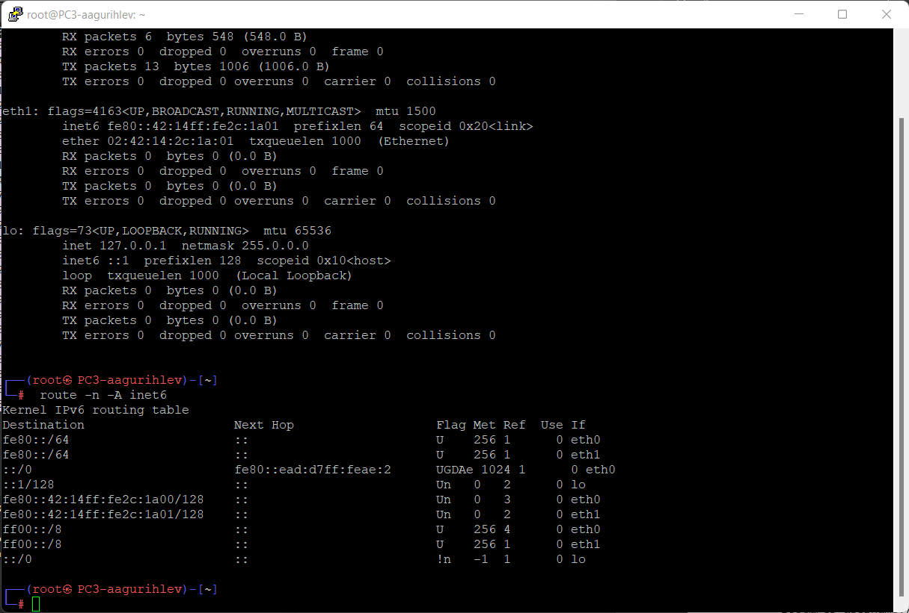{#fig-020}

([рис. @fig-021])

{#fig-021}

([рис. @fig-022])

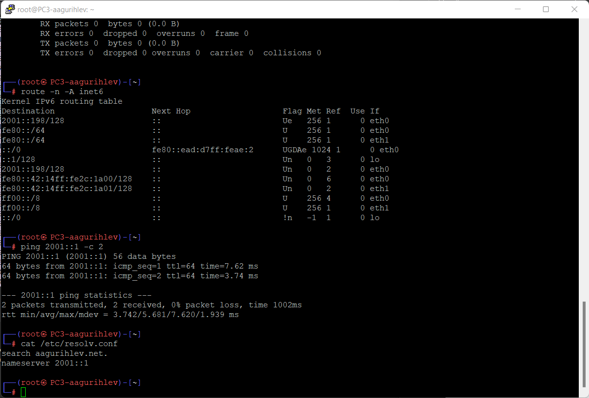{#fig-022}

([рис. @fig-023])

{#fig-023}

([рис. @fig-024])

{#fig-024}

# Выводы

Здесь кратко описываются итоги проделанной работы.