---
## Author
author:
  name: Гурылев Артем Андреевич
  email: 1132236135@pfur.ru
  affiliation:
    - name: Российский университет дружбы народов

## Title
title: "Лабораторная работа №8"
subtitle: "Адресация IPv4 и IPv6. Настройка маршрутизации"
license: "CC BY"
---

# Цель работы

Целью этой работы является изучение принципов маршрутизации в IPv4 и IPv6 сетях и принципов настройки сетевого оборудования.

# Выполнение лабораторной работы

Настроим топологию, как указано в лабораторной работе.

Присвоим IPv4 адрес PC1.([рис. @fig-001])

{#fig-001}

Присвоим IPv4 адрес PC2.([рис. @fig-002])

{#fig-002}

Теперь присвоим IPv4 адреса маршрутизаторам, начиная с первого.([рис. @fig-003])

{#fig-003}

Присвоим IPv4 адрес второму маршрутизатору.([рис. @fig-004])

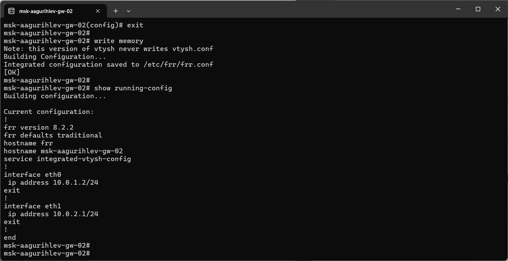{#fig-004}

Присвоим IPv4 адрес третьему маршрутизатору.([рис. @fig-005])

{#fig-005}

Присвоим IPv4 адрес четвертому маршрутизатору.([рис. @fig-006])

{#fig-006}

Теперь присвоим IPv6 адреса. Начнем с PC1.([рис. @fig-007])

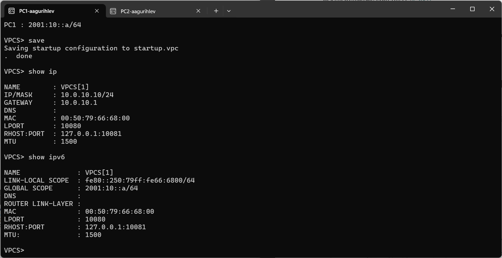{#fig-007}

Присвоим IPv6 адрес PC2.([рис. @fig-008])

{#fig-008}

Присвоим IPv6 адрес первому маршрутизатору.([рис. @fig-009])

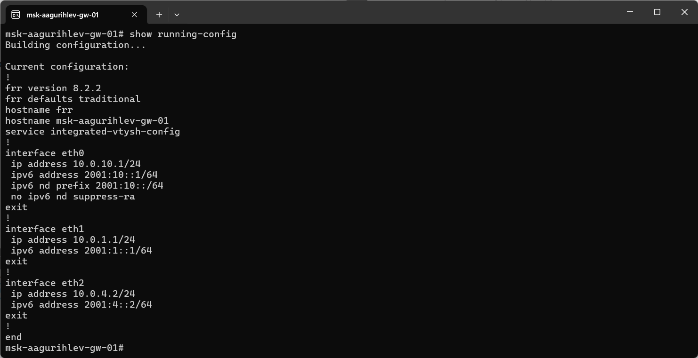{#fig-009}

Присвоим IPv6 адрес второму маршрутизатору.([рис. @fig-010])

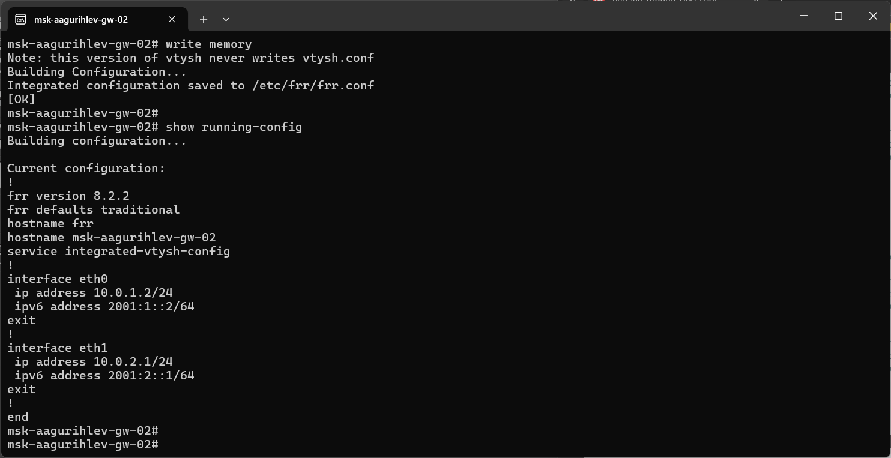{#fig-010}

Присвоим IPv6 адрес третьему маршрутизатору.([рис. @fig-011])

{#fig-011}

Присвоим IPv6 адрес четвертому маршрутизатору.([рис. @fig-012])

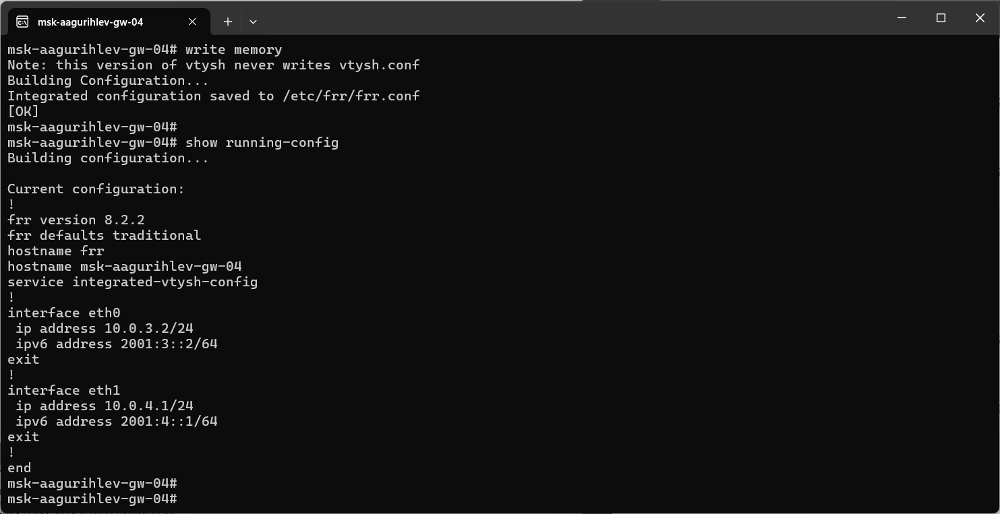{#fig-012}

Перейдём к настройке RIP протокола на каждом маршрутизаторе. Начнем с первого.([рис. @fig-013])

{#fig-013}

Настроим RIP протокол на втором маршрутизаторе.([рис. @fig-014])

{#fig-014}

Настроим RIP протокол на третьем маршрутизаторе.([рис. @fig-015])

{#fig-015}

Настроим RIP протокол на четвертом маршрутизаторе, а затем посмотрим статистику по этому протоколу, убедившись, что он правильно настроен.([рис. @fig-016])

{#fig-016}

Пропингуем PC2 с PC1, посмотрим маршрут следования пакетов.([рис. @fig-017])

{#fig-017}

Теперь посмотрим метрики протокола RIP.([рис. @fig-018])

{#fig-018}

Чтобы наблюдать за поведением протокола RIP, отключим интерфейс второго маршрутизатора, и посмотрим статистику после этого.([рис. @fig-019])

{#fig-019}

После восстановления маршрута пропингуем PC2 с PC1. Это заняло примерно одну-две минуты.([рис. @fig-020])

{#fig-020}

Включим обратно второй маршрутизатор - пинг тоже стал идти через него после нескольких минут. Обратимся к захваченному трафику - с первой точки мы можем увидеть, что пинг не смог дойти до точки назначения, а также мы можем увидеть пакет протокола RIP - он обращается к таблице маршрутизации, обновляя её, и тем самым строя новый маршрут для устройств сети.([рис. @fig-021])

{#fig-021}

Со второй точки видны пакеты протокола RIP, а также пинг пакеты после того, как образовался новый маршрут.([рис. @fig-022])

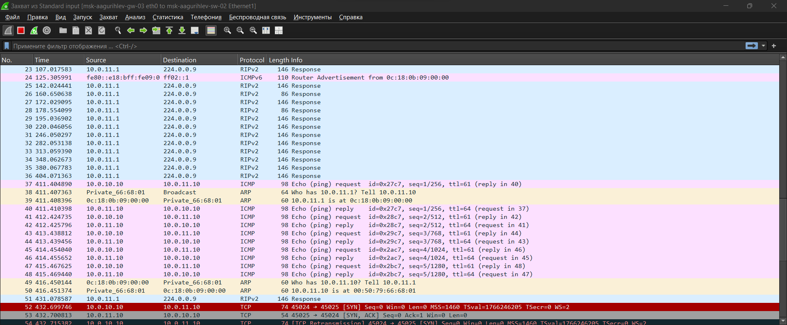{#fig-022}

Настроим протокол RIPng на всех маршрутизаторах, чтобы маршрутизация проходила и по IPv6, затем пропингуем PC2 с PC1. Пинг всё также проходит через второй маршрутизатор.([рис. @fig-023])

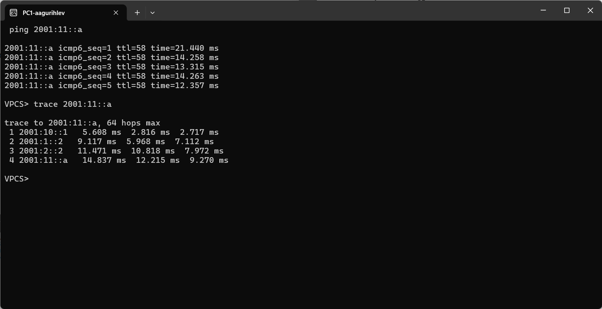{#fig-023}

Посмотрим статистику RIPng.([рис. @fig-024])

{#fig-024}

По аналогии с RIP отключим второй маршрутизатор и измерим время появления нового маршрута. Он всё также составляет одну-две минуты, и за столько же он восстанавливается.

Обратимся к захваченному трафику. С первой точки можно заметить, что наш пинг не проходил в начале, поскольку маршрут ещё не успел сформироваться.([рис. @fig-025])

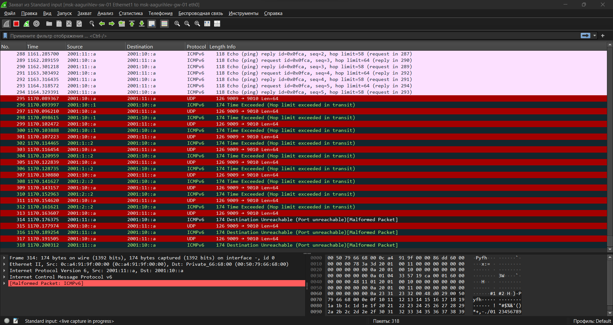{#fig-025}

Со второй же точки видно, когда пришел пинг, и видно, как протокол RIPng также обращается к таблице маршрутизации.([рис. @fig-026])

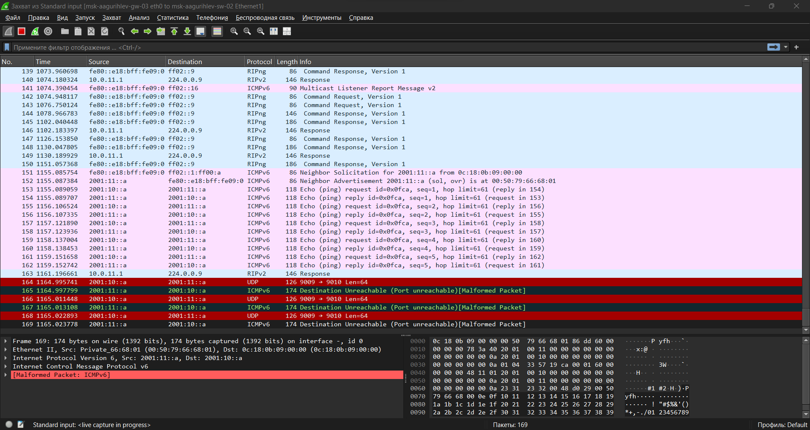{#fig-026}

Теперь применим протокол OSPF, и затем сравним его с RIP. Настроим IPv4 версию этого протокола на маршрутизаторах, затем проведём пинг от PC1 к PC2.([рис. @fig-027])

{#fig-027}

Посмотрим статистику этого протокола, а также ближайших соседей к первому маршрутизатору.([рис. @fig-028])

{#fig-028}

По аналогии отключим второй маршрутизатор, и проверим статистику. Соседа стало на одного меньше, как и ожидалось.([рис. @fig-029])

{#fig-029}

После этого проведём пинг от PC1 к PC2. Новый маршрут появился мгновенно, в отличии от протокола RIP. Также и с восстановлением маршрута - задержки нет.

Обратимся к трафику. По пакетам видно, что OSPF обновляет таблицу маршрутизации чаще, просматривая, какие пути доступны, а какие нет.([рис. @fig-030])

{#fig-030}

Со второй точки также видны многочисленные пакеты протокола OSPF, нужные для проверки и обновления таблицы.([рис. @fig-031])

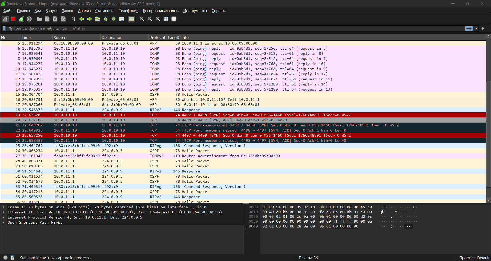{#fig-031}

Теперь настроим протокол OSPF по IPv6 на всех маршрутизаторах - начнем с первого.([рис. @fig-032])

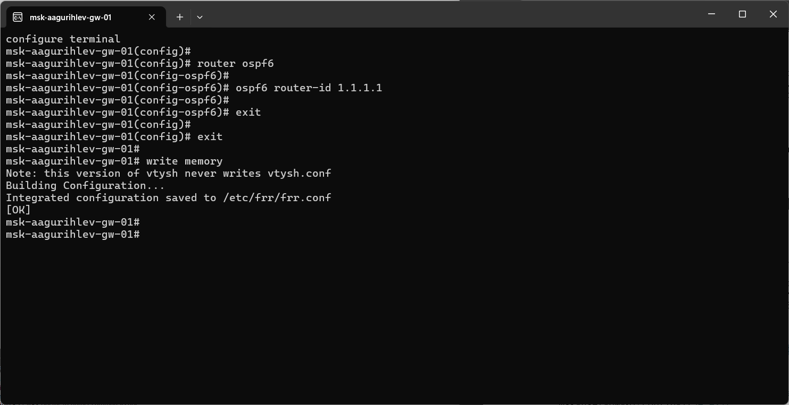{#fig-032}

После настройки проведем пинг от PC1 к PC2 по IPv6.([рис. @fig-033])

{#fig-033}

Посмотрим статистику OSPF6.([рис. @fig-034])

{#fig-034}

По аналогии с предыдущими шагами отключим второй маршрутизатор, и проверим статистику.([рис. @fig-035])

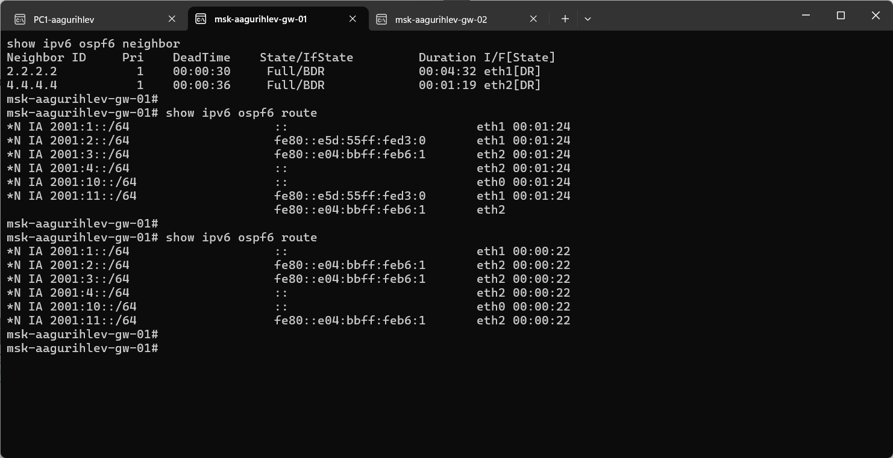{#fig-035}

Пропингуем PC2 с PC1. Как и с версией IPv4, новый маршрут появляется очень быстро, и очень быстро восстанавливается.([рис. @fig-036])

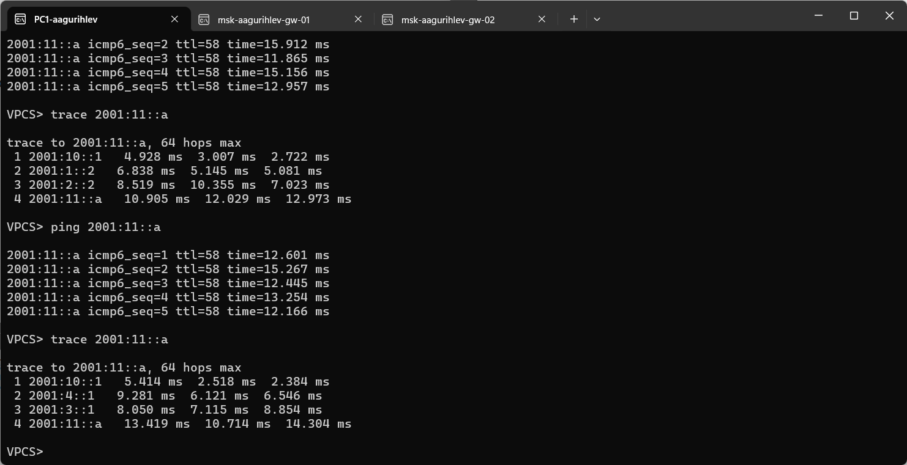{#fig-036}

Обратимся к трафику. Теперь появились пакеты OSPF, которые идут через IPv6.([рис. @fig-037])

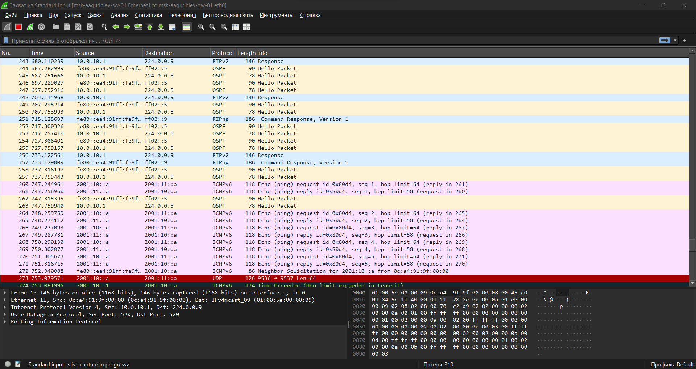{#fig-037}

На второй точке захвата эти пакеты тоже присутствуют.([рис. @fig-038])

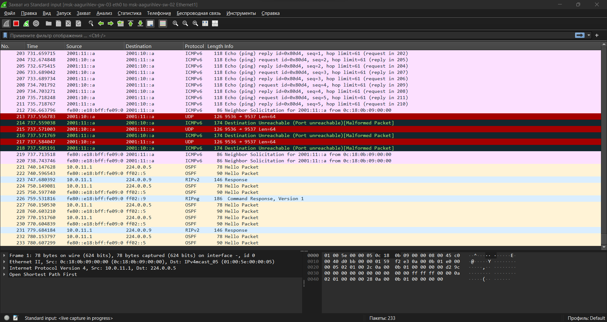{#fig-038}

Перейдём к созданию туннеля IPv6-IPv4. Создадим топологию сети согласно лабораторной работе.([рис. @fig-039])

{#fig-039}

Присвоим IP адреса PC1.([рис. @fig-040])

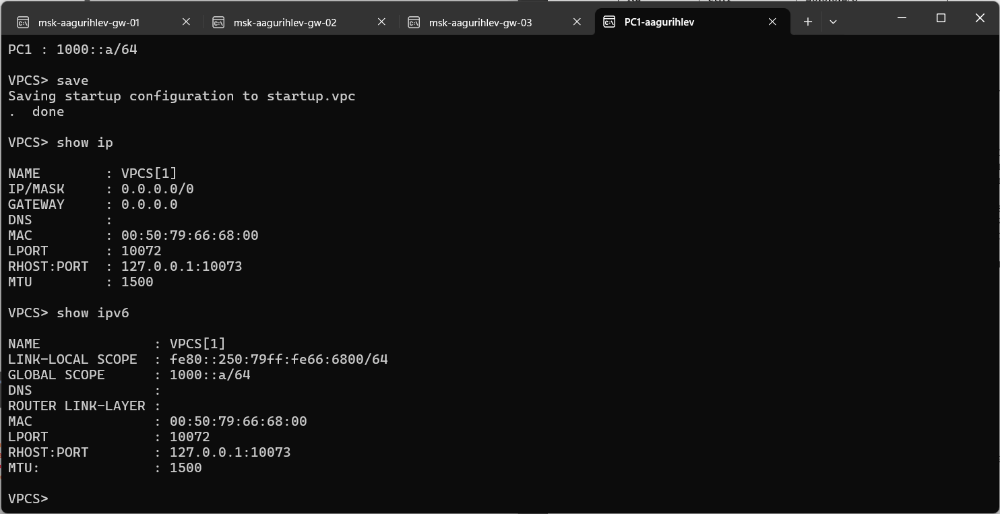{#fig-040}

Присвоим IP адреса PC2.([рис. @fig-041])

{#fig-041}

Присвоим IP адреса и настроим маршрутизаторы, начиная с первого.([рис. @fig-042])

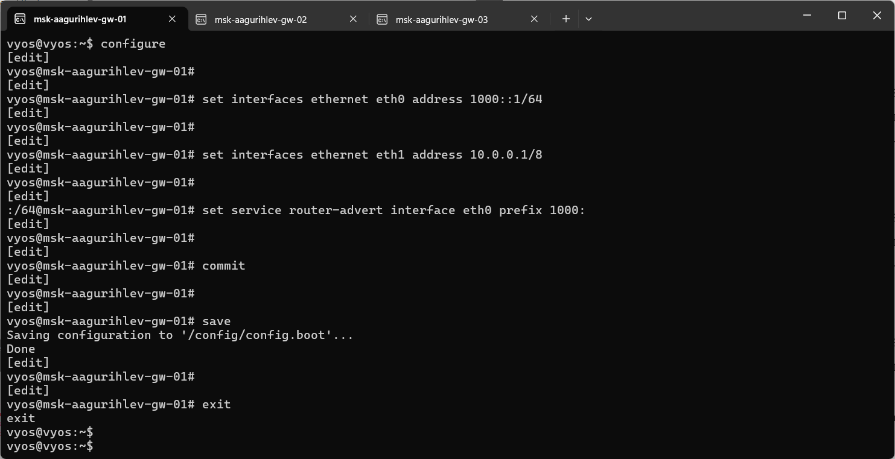{#fig-042}

Настроим третий маршрутизатор - было необходимо удалить dhcp с первого интерфейса, чтобы правильно его настроить.([рис. @fig-043])

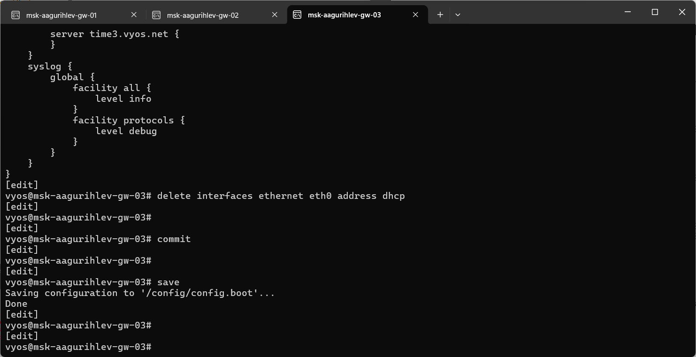{#fig-043}

Теперь проведём пинг с первого маршрутизатор ко второму, третьему, и ко второму компьютеру в том числе. Так как не настроена маршрутизация и туннель, пинг ко второму маршрутизатору и компьютеру не может дойти через третий маршрутизатор из-за отсутствия правильной маршрутизации IPv4.([рис. @fig-044])

{#fig-044}

Обратимся к трафику. Можем увидеть, что пинг действительно доходит до третьего маршрутизатора.([рис. @fig-045])

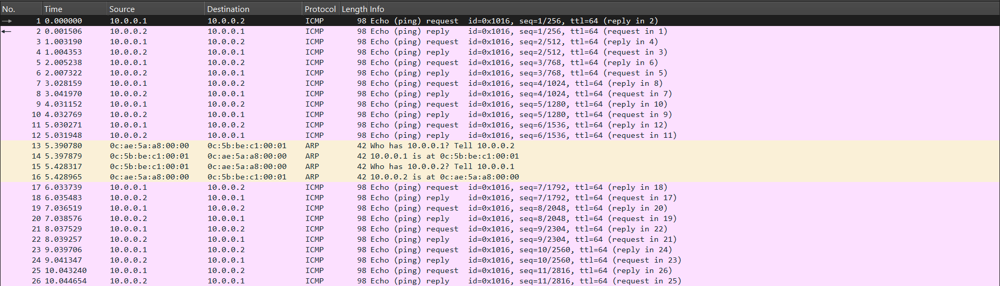{#fig-045}

Настроим маршрутизацию, после чего снова проведём пинг. Теперь всё исправно доходит, как и показывает захват трафика.([рис. @fig-046])

{#fig-046}

Настроим туннель, чтобы отправлять IPv6 трафик через IPv4, после чего пропингуем PC2 от PC1 - всё доходит.([рис. @fig-047])

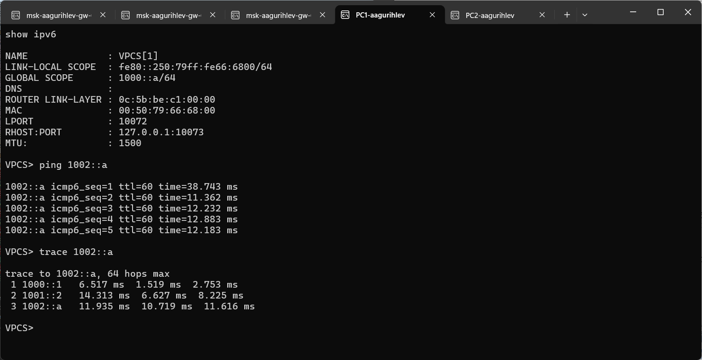{#fig-047}

В обратную сторону всё тоже работает.([рис. @fig-048])

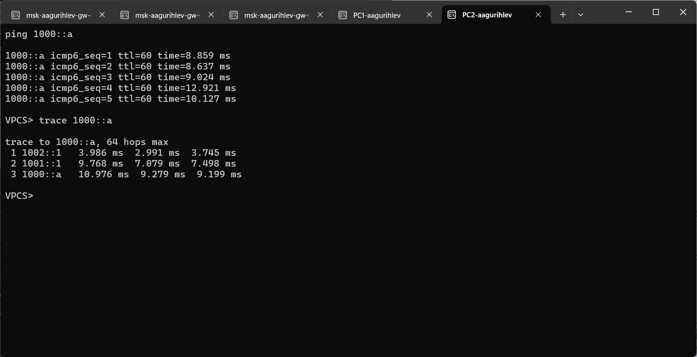{#fig-048}

Обратимся к захваченному трафику. Прохождение по туннелю обозначается большей фрагментацией, а также большим размером самого пакета, ведь в IPv4 необходимо положить информацию о IPv6.([рис. @fig-049])

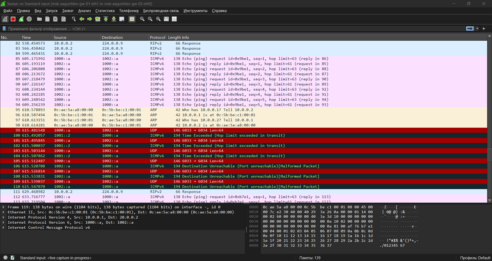{#fig-049}

# Выводы

В этой лабораторной работе я настроил маршрутизацию IPv4 и IPv6 через несколько протоколов, а также создал туннель IPv6-IPv4 с помощью энкапсуляции.